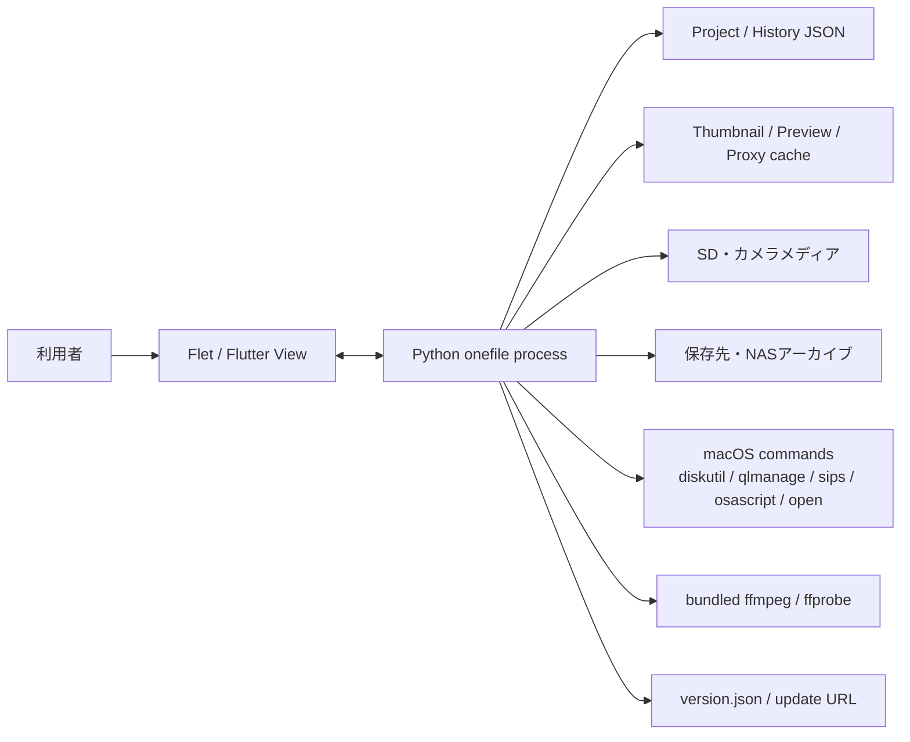
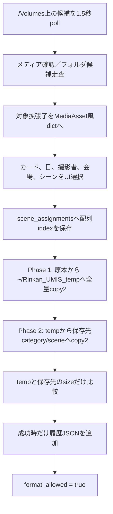
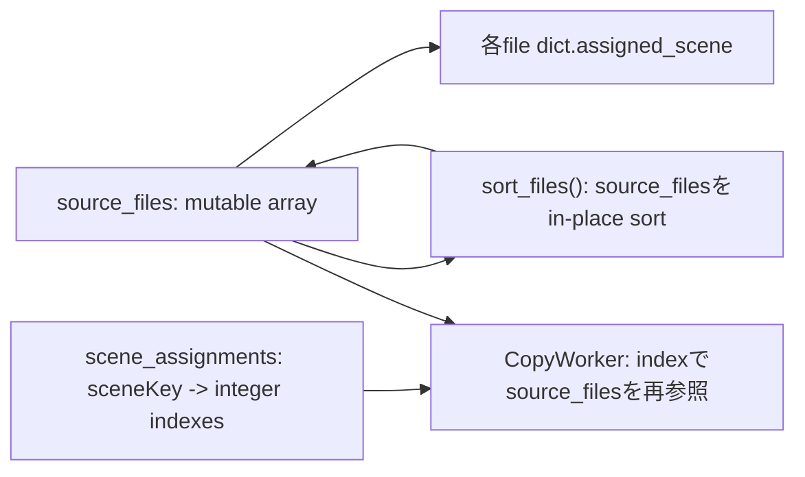

# 現行アーキテクチャとデータ

## 1. システム境界

現行RINKAN UMISは、1本のPythonソースをPyInstaller onefileへまとめ、別途展開されるFlet/Flutter画面プロセスと通信するデスクトップアプリです。アプリ本体は、Flet UI、業務状態、JSON永続化、ファイルコピー、メディア解析、キャッシュ、外部ボリューム監視、`diskutil`による消去、更新、診断、自己テストまでを同一プロセス・同一ファイル内で扱います。



画面を担うFlet Viewが別プロセスであるため、開発者パネルがPython親プロセスのRSSだけを表示しても、利用者が実際に消費するメモリ全体にはなりません。

## 2. ソース構成

対象ソースは [rinkan_umis_v1.1.103.py](legacy-source/rinkan_umis_v1.1.103.py:1) です。

| クラス | 開始行 | 直接メソッド数 | 実責務 |
|---|---:|---:|---|
| `_DevPanelLogCaptureHandler` | 312 | 1 | 開発者パネルへのログ転送 |
| `_InstrumentedPageLock` | 346 | 6 | Flet private lockの計測ラッパー |
| `_InstrumentedSemaphore` | 1240 | 2 | 外部メディア処理の待ち時間計測 |
| `UIStyles` | 1265 | 0 | 色、文字、ボタンスタイル |
| `HistoryLogger` | 1381 | 6 | 月別取り込み履歴JSON |
| `ConfigManager` | 1434 | 18 | プロジェクトJSON、リスト、シーン、命名 |
| `CopyWorker` | 1676 | 5 | 取り込みの二段コピーとサイズ検証 |
| `SelectWorker` | 2007 | 2 | 旧セレクトコピー実装。現行経路からは使われない |
| `FormatWorker` | 2105 | 2 | ExFAT初期化 |
| `RinkanUMISApp` | 2240 | 348 | 画面、状態、スキャン、コピー、選別、メディア、設定、履歴、デバイス、更新、診断 |

AST集計では全ネスト関数を含め619関数、クラス直下390メソッドです。`RinkanUMISApp.__init__`だけで216種類の`self`属性を初期化します。現行の本質的な問題は行数そのものではなく、書き込み可能な共有状態へ、UIイベント、Timer、Executor、専用スレッド、worker、外部プロセス完了処理が同時に触れることです。

### 2.1 起動時の副作用

モジュールimportからウィンドウ表示までに、次が同期または自動で始まります。

- Flet、Pillow、psutil、rawpy、pillow-heif、flet-video等のimport
- Application Support、cache、logディレクトリの作成
- duration cache JSON全体の読込
- ログ、faulthandler、watchdog用ファイルの初期化
- FFmpeg／ffprobe探索と、それぞれ`-version`による実行確認
- UIコントロール、複数Executor、各種状態の一括構築
- 更新確認thread、Flet日本語化thread、レイアウトthread、freeze watchdog、drive monitor、Timerの起動

FFmpegの同期検証は [1207行](legacy-source/rinkan_umis_v1.1.103.py:1207)、自動起動される背景処理は [2750行付近](legacy-source/rinkan_umis_v1.1.103.py:2750) です。

## 3. 現行データフロー

### 3.1 取り込み



コピー元から保存先へ直接一段で保存するのではなく、一度ホーム側固定tempへ全量コピーしてから、保存先へ全量コピーします。[`CopyWorker._run_inner()`](legacy-source/rinkan_umis_v1.1.103.py:1749)

この方式は、同一内蔵ディスクをtempと保存先が共有する場合でも2倍近いI/Oを発生させ、source全量分のtemp空き容量を必要とします。キャンセルはファイル間でしか確認せず、`copy2`の途中は止まりません。失敗時のresume manifestはなく、finallyでtempを削除します。

### 3.2 セレクト

セレクトモードは保存先アーカイブを再帰走査し、同一シーン名のフォルダをカテゴリ横断で集約します。星または選択フラグを付けた素材を、各カテゴリ／シーン配下の`選別`サブフォルダへコピーします。現在使われるのは`SelectWorker`クラスではなく、`_start_select_copy()`内の生thread実装です。[`_start_select_copy()`](legacy-source/rinkan_umis_v1.1.103.py:7205)

セレクト側の「シーン移動」は、アーカイブ内の物理ファイルを別シーンへ移し、対応する`選別`コピーも別途移動します。両者は1トランザクションではありません。[`_execute_move_files()`](legacy-source/rinkan_umis_v1.1.103.py:5044)

## 4. 永続データ

### 4.1 基本ディレクトリ

通常のmacOSでは、アプリデータは `~/Library/Application Support/Rinkan_UMIS` です。環境変数`RINKAN_UMIS_BASE_DIR`があれば優先されます。[基本パス決定](legacy-source/rinkan_umis_v1.1.103.py:83)

| パス | 内容 | 備考 |
|---|---|---|
| `.../projects/<name>.json` | プロジェクト設定 | `.bak`を併用、schema versionなし |
| `.../history/history_YYYYMM.json` | 月別取り込み履歴 | JSON配列、成功時中心 |
| `.../duration_cache.json` | 動画・音声duration | 全件load／全件rewrite、上限なし |
| `.../logs/rinkan_umis.log` | 通常ログ | 2MiB×本体＋3世代 |
| `.../faulthandler_*.log` | 起動ごとの障害ログ | 保持上限なし |
| `.../freeze_dump_*.txt` | フリーズダンプ | 保持上限なし |
| `.../watchdog_pulse.txt` | watchdog pulse | 2秒ごとに上書き |
| `<dest>/.rinkan_umis_cache/` | preferred cache | 保存先へ隠しディレクトリを作る |
| `.../.rinkan_umis_cache/` | fallback cache | 保存先に書けない場合 |
| `~/Rinkan_UMIS_temp/` | 取り込みtemp | base dir設定を無視する固定パス |
| `~/.flet/bin/flet-<ver>/` | Flet画面runtime | 不完全版を退避するが世代pruneなし |

起動時には`base_dir/thumbnails`、`base_dir/previews`、`base_dir/thumb_cache`も作られますが、現行cache APIの主経路とは一致せず、legacyディレクトリとして残り得ます。[初期cache作成](legacy-source/rinkan_umis_v1.1.103.py:95) / [再定義](legacy-source/rinkan_umis_v1.1.103.py:273)

### 4.2 プロジェクト設定schema

既定schemaは [`ConfigManager._load_config()`](legacy-source/rinkan_umis_v1.1.103.py:1443) にハードコードされています。

| キー | 内容 |
|---|---|
| `settings.day_count` | 4固定 |
| `paths.temp_dir` | temp設定。実コピーでは使われない |
| `paths.dest_root` | アーカイブ保存先 |
| `current_location` / `locations` | 会場と候補一覧 |
| `card_ids` | カードID候補 |
| `photographers` | 撮影者候補。旧dict形式も一部許容 |
| `scenes` | `{day,num,name}`。day 0がその他、day 1〜4 |
| `exclusions.extensions/folders` | 走査除外 |
| `category_settings` | カテゴリごとのenabled、folder、extensions |
| `options` | 命名、選別、UI、初期化等 |
| `rename_order` | 命名要素順 |
| `folder_order` | 読込時に固定値へ直されるだけで出力に未使用 |
| `last_day_tab` / `last_worked_date` | 日跨ぎ確認用 |
| `last_state` | 定義されるが実運用状態復元には未使用 |

既定カテゴリは次のとおりです。

| 論理カテゴリ | 既定フォルダ | 既定拡張子 |
|---|---|---|
| Movie | `動画` | `.mp4 .mov .mxf .avi .mkv .mts` |
| Photo | `写真` | `.jpg .jpeg .png .heic .heif .tiff` |
| Raw | `Raw` | `.arw .cr2 .cr3 .nef .raf .orf .dng .rw2` |
| Audio | `音声` | `.wav .mp3 .aac .m4a` |

`.tif`はサムネイル処理側には考慮がありますが、既定スキャン拡張子には含まれません。

### 4.3 設定上は存在するが、現行コピーへ反映されない項目

| 設定 | 現行実態 |
|---|---|
| `verify_checksum` | 一度も参照されず、hash検証なし |
| `paths.temp_dir` | 無視され、`~/Rinkan_UMIS_temp`固定 |
| `create_scene_folder` | 実出力分岐に未使用 |
| `create_category_folder` | 実出力分岐に未使用 |
| `create_photographer_folder` | 撮影者フォルダは作られない |
| `folder_order` | 実出力順に未使用 |
| `scene_num_digits` | 出力は2桁hard-code |
| `last_state` | セッション復元に未使用 |

また、会場名をファイル名へ付ける設定はプレビューでは動作しますが、CopyWorkerが`scene_info['venue']`を埋めないため、実ファイル名へ反映されません。[命名](legacy-source/rinkan_umis_v1.1.103.py:1656) / [CopyWorker呼出](legacy-source/rinkan_umis_v1.1.103.py:1936)

### 4.4 設定保存

JSONは同一ディレクトリの`<name>.tmp<PID>`へ書いて`os.replace()`します。[`_write_json_atomic()`](legacy-source/rinkan_umis_v1.1.103.py:578) ただし、writer lock、fsync、directory fsyncはありません。同一プロセス内の並行保存は同じtemp名を使います。

保存前にmainを`.bak`へcopyしますが、`_copy2_bounded()`は内部copyが例外でも完了イベントを立て、成功相当を返します。timeout後もdaemon threadを停止できません。[`_copy2_bounded()`](legacy-source/rinkan_umis_v1.1.103.py:611)

読み込み時のdefault mergeはtop-level中心の浅いmergeで、`category_settings`等の部分dictは既定子要素を丸ごと失う場合があります。型、必須key、値域、schema versionの検証はありません。

## 5. ランタイムモデル

### 5.1 素材

スキャン結果の各素材は、おおむね次のmutable dictです。

```text
name, path, ext, size, cat, date, mtime, mtime_ns, date_only,
selected, assigned_scene, is_selected_for_edit
```

さらに`duration`、`codec_label`、`_select_locked`等が必要時に動的追加されます。正式なschemaや型境界はありません。[素材生成](legacy-source/rinkan_umis_v1.1.103.py:5262)

### 5.2 シーン割当

素材dictには`assigned_scene`文字列がある一方、実コピーの正本は別dictの`scene_assignments: sceneKey -> [source_files index]`です。



この二重モデルは同期されません。画面件数は各dictの`assigned_scene`を見ますが、コピーは`scene_assignments`のindexを見ます。そのため、表示上の割当と実コピー対象が異なり得ます。

### 5.3 セッションcache

取り込みセッションは、概ね次をメモリ内に保持します。

```text
media_key, files, scene_assignments, selected_scene_info,
scanned_at, large_scan_approved
```

セレクト側にも`key, files, scanned_at`があります。コピーは浅い`list()`／`dict()`で、要素dictや割当listは共有されます。プロセスを終了すると失われ、クラッシュ復旧へ使える永続journalではありません。[session save/restore](legacy-source/rinkan_umis_v1.1.103.py:8538)

## 6. 命名と出力構造

実出力は次です。

```text
<dest_root>/
  <category.folder>/
    <day1桁><scene number 2桁>_<scene name>/
      <生成名>
      <選別subfolder>/
        <生成名のコピー>
```

撮影者フォルダは作りません。ファイル名は`rename_order`に従い、会場、シーン、日付、撮影者、カードIDのうち有効なものを`_`で連結し、最後に元ファイル名または4桁連番を付けます。[`generate_filename()`](legacy-source/rinkan_umis_v1.1.103.py:1656)

日付は対応画像のEXIF DateTimeOriginalを優先し、その他はmtime、取得失敗時は現在時刻です。連番は各CopyWorkerで1へ戻り、既存アーカイブの最大番号を参照しません。

`sanitize_text()`はASCII英数字、日本語、空白、`_-.()[]%`だけを許しますが、`.`と`..`を拒否せず、標準化後に保存先ルート配下か再検証しません。[`sanitize_text()`](legacy-source/rinkan_umis_v1.1.103.py:2962) 特にカテゴリフォルダや選別フォルダを`..`にすると、UI経由でも意図したサブフォルダから逸脱し得ます。JSON手編集ではさらに任意パス要素が入ります。

## 7. スキャン

### 7.1 外部メディア検出

`psutil.disk_partitions()`を1.5秒間隔でpollし、`removable`／`cdrom`、またはmountpointが`/Volumes`で始まるものを候補にします。[drive monitor](legacy-source/rinkan_umis_v1.1.103.py:13973)

表示IDはmount basenameで、同名は列挙順に`(2)`、`(3)`を付けます。Volume UUID、file system UUID、BSD whole disk、device serial、挿入世代は記録しません。非表示mediaも表示文字列で保存するため、抜き差しや同名カードで安定しません。

### 7.2 フォルダ走査

- hidden directoryと設定除外folderを枝刈り
- Unicode NFC＋casefoldで除外名を比較
- symlink directoryは追跡しない
- まずtop folderごとに再帰的な件数／最新時刻を収集
- 合計800件以下は全folderを自動本スキャン
- 800件超はfolder選択UIを表示
- その後、対象拡張子をstatし素材dictを構築

800件以下でも「軽量count」と本スキャンで全ツリーを実質2回読みます。軽量再帰countには途中cancel checkがなく、低速SD／NASでは不要な走査が続きます。[folder pre-scan](legacy-source/rinkan_umis_v1.1.103.py:9034)

OSからのファイル／フォルダDrag & Drop importは実装されていません。存在するDnDはシーンの並べ替えです。file cardの`on_enter`はありますが、`is_dragging=True`へする経路がなく、drag範囲選択はdeadです。

## 8. メディア処理

### 8.1 使用技術

| 種別 | 現行優先経路 |
|---|---|
| JPEG/PNG/TIFF/HEIC | Pillow＋pillow-heif、失敗時sips／FFmpeg |
| RAW | rawpy embedded thumbnail、Quick Look、sips |
| Movie thumbnail | Quick Look、FFmpeg、再度Quick Look |
| Movie live preview | flet-video。必要なら背景でH.264/AAC 540p proxy |
| Movie poster/1080 preview | FFmpeg／Quick Look等をcache |
| Movie scrub | FFmpegで10フレーム |
| Audio | Flet Audioで再生、Pillowで波形風サムネイル |
| Duration/codec | ffprobe JSON／format duration |

静止画／RAW previewは最大1920×1080 JPEG quality 80、サムネイルは最大160px程度です。動画proxyはH.264/AAC、540p、faststartです。スクラブは通常3〜97%の10地点を320px JPEGで生成します。

メディア外部プロセスは共通`run_hidden()`でprocess group、timeout、active registry、generation cancelを扱います。[`run_hidden()`](legacy-source/rinkan_umis_v1.1.103.py:994) ただし`diskutil eraseVolume`、eject、force unmount、updater等は共通wrapper外です。

FFmpeg／ffprobe探索順は、環境変数、PyInstaller展開先／App Bundle、source vendor、PATH、Homebrew／MacPorts既知パスです。配布版でも環境変数の任意実行ファイルが同梱版より優先されます。

### 8.2 cache

preferred cacheは`<dest_root>/.rinkan_umis_cache`です。書込probeに失敗するとApplication Support側へfallbackします。[cache root](legacy-source/rinkan_umis_v1.1.103.py:8140)

| 種類 | ファイル | 上限 |
|---|---|---|
| thumbnail | `<md5>_v4.jpg` | なし |
| 1080 preview | `<md5>_p1080.jpg` | なし |
| 540p proxy | `<md5>_p540.mp4` | 10GiB |
| scrub | `<md5>_s0.jpg`〜`s9.jpg` | 2GiB |
| duration | JSON | なし |

cache signatureは、保存先内なら相対path、それ以外は絶対pathに、sizeとmtime_nsを連結したものです。内容hashではありません。[signature](legacy-source/rinkan_umis_v1.1.103.py:8209)

thumbnail／preview／proxyは同一directoryのtmpへ書いてからreplaceする経路があります。scrubはfinalへ直接出力します。Quick Lookは共有directoryへ元basename由来PNGを出し、globで回収するため、同名素材の並行処理で取り違えの余地があります。

設定の「すべてのローカルキャッシュを完全消去」は、現在選択中cache rootのthumbnailとpreview中心で、proxy、scrub、duration、legacy、過去保存先のcacheを消しません。

## 9. copy、duplicate、cancelの意味

### 9.1 取り込み

| 状態 | 現行処理 |
|---|---|
| final不存在 | tempからfinalへ`copy2` |
| final存在 | 内容・size・hashを見ず`skipped += 1` |
| copy後 | temp sizeとfinal sizeだけ比較 |
| size一致 | `success += 1` |
| finalが部分ファイル | 削除／隔離しない |
| cancel | ファイル間のflag確認。実行中copyは止まらない |
| worker終了 | `fail == 0`なら成功。skippedは成功を妨げない |
| temp | success/fail/cancelを問わずfinallyで削除 |

### 9.2 セレクト

既存同名はcopyしませんが、`copied_count`へ加えます。既存dstへ新sourceのサムネイル／duration cacheを結び付けることもあります。ループ全体が大きな1つのtryに入るため、1件例外で後続を停止し、既コピー分を残します。表示されるcancelは`current_copy_worker`を止めるだけで、この生threadへ届きません。

## 10. 履歴とログ

### 10.1 取り込み履歴

月別JSONのentryは、概ね次です。

```text
id, date, photographer, card_id, status,
total_count, total_size, size_details, count_details,
scene_details, save_dest, formatted
```

成功時にだけ追加されるため、途中までコピーできた失敗／cancelは履歴に残りません。scene detailのkeyはscene名だけで、異なる日でも同名なら合算します。JSON破損月は黙って読み飛ばし、backupはありません。全履歴clearは月ファイルを直接unlinkします。

フォーマット完了時は対象volumeやrunとの一致ではなく、グローバルな`last_execution_id`の履歴を`formatted=True`へします。そのため緊急初期化では無関係な直近履歴が更新され得ます。

### 10.2 ログ

通常ログにはfull path、利用者名を含むpath、permissionのowner/group/mode、stack等が入り得ます。faulthandlerとfreeze dumpに保存期限がありません。Swift版ではOSLog privacy、retention、利用者が明示する診断bundle exportが必要です。

## 11. macOS外部操作

| 操作 | 現行実装 | Swift置換候補 |
|---|---|---|
| フォルダ選択 | System Events `choose folder`のosascript、最大300秒 | `NSOpenPanel` |
| 通知 | osascript `display notification` | UserNotifications |
| Finderで開く | `open` | `NSWorkspace` |
| 画像変換 | `sips` / `qlmanage` | ImageIO / QuickLookThumbnailing |
| メディア解析 | FFmpeg / ffprobe | AVFoundation＋必要時だけhelper |
| volume監視 | psutil poll | Disk Arbitration＋NSWorkspace通知 |
| eject | `diskutil eject` | Disk Arbitration callback |
| force unmount | `diskutil unmount force` | 原則廃止／厳格な別操作 |
| erase | `diskutil eraseVolume ExFAT` | 実装必須。stable identity＋verified receipt＋one-shot token＋専用service |
| permission修復 | osascript adminで再帰`chgrp/chmod` | 既存treeの再帰変更を廃止 |

管理者permission修復は対象root全体へ`chgrp -R`とgroup権限を再帰適用します。システムの広いrootは拒否しますが、NASや外部volumeの既存ACL／group方針を壊す可能性があります。[permission repair](legacy-source/rinkan_umis_v1.1.103.py:847)

## 12. 初期化と取り出し

### 12.1 初期化

`FormatWorker`は選択mountpointに一致するpartitionをその時点で探し、deviceへ`diskutil eraseVolume ExFAT`を実行します。[FormatWorker](legacy-source/rinkan_umis_v1.1.103.py:2105)

認可状態は`format_allowed`、現在の表示文字列、`last_ingested_drive`、永続化される`emergency_fmt`で決まります。Volume UUIDや挿入世代ではありません。抜去で通常認可を確実に失効させません。`diskutil`実行にtimeoutがなく、worker参照も保持されないため、開始後にUIから監視・cancelできません。

### 12.2 取り出し

取り出し要求は、実際のeject成功を待つ前に、source、割当、撮影者、カードID、日、format許可、drive mapをUI状態から消します。その後でbackground threadがmedia processを止め、`diskutil eject`を最大2回実行します。失敗すると、物理volumeは残っているのにUIから消えた状態になり得ます。drive monitorは表示名集合が同じなら早期returnするため、自動復帰しない場合があります。

## 13. 自動更新

起動時にthreadで固定placeholder URL `https://raw.githubusercontent.com/user/repo/main/version.json`へアクセスします。[起動thread](legacy-source/rinkan_umis_v1.1.103.py:2751) / [check](legacy-source/rinkan_umis_v1.1.103.py:14070) 隔離実行でもHTTP 404を確認しました。

version比較は文字列の`>`です。更新URLが有効なら、任意URLからtimeoutなしで全内容を`.py`へ保存し、hash、署名、content type、size、許可domainを検証せず、shellで`sys.argv[0]`を置換して`python3`実行します。[execute update](legacy-source/rinkan_umis_v1.1.103.py:14114)

PyInstaller appではMach-OをPython textへ置き換えるため動作自体も破壊します。新Swift版へ移植しません。

## 14. buildと配布

PyInstaller specは次の構成です。

- 最新番号の`rinkan_umis_v1.1.*.py`を自動選択
- vendor、Flet tar、pillow-heif、rawpy、flet-video native依存を収集
- onefile/windowed、UPX有効
- `target_arch=None`
- `codesign_identity=None`
- `entitlements_file=None`
- `bundle_identifier=None`

build scriptはCPU別にarm64／x86_64成果物を作る想定ですが、現物vendorと配布appはarm64のみです。build時には同梱Fletの署名、FFmpeg起動／arch／Homebrew非依存、オフラインFlet起動、メディア自己診断、ZIP／DMG整合性、SHA-256を確認します。この自己診断は配布runtimeの同梱確認として有用ですが、業務コピーや破壊操作のテストではありません。

配布appはad-hoc署名で、利用者向けlauncherがquarantineを再帰削除します。新設計ではXcode archive、Developer ID、Hardened Runtime、公証、stapleへ置き換えます。

## 15. After Effects補助スクリプト

ZIP内のJSX群はUMIS本体から呼ばれていません。`.jsx`、After Effects、`aerender`へ接続するPythonコードはなく、AEから手動実行する独立補助物です。

| ファイル | 機能 | 主な注意 |
|---|---|---|
| `AE_顔写真_公転収束セットアップ.jsx` | Pxx顔レイヤーへ位置、scale、opacity式と共通controllerを設定 | 既存式を上書き。事前別名保存と手動Undo前提 |
| `AE_P01-P07_複数顔配置セットアップ.jsx` | P01を複製しP01〜P07を固定配置 | 1920×1080、予約名、既存comp構造に依存 |
| `AE_30人顔写真_光球吸い込み完成版.jsx` | P01〜P30、marker、光球comp、expressionを一括構築 | 同名compのlayer全削除等、破壊的変更あり |
| `ae_inspect_active_project.jsx` | active project/comp/layer/expressionのalert診断 | 読取専用 |
| `ae_inspect_nested_face_errors.jsx` | P01〜P30のexpression error診断 | 読取専用 |

Swift版初版ではアプリ機能へ統合せず、任意resource／別utilityとして分類するのが現行互換です。正式連携は別要件として扱います。

## 16. Swiftへ引き継ぐべき契約と、引き継がない実装

### 引き継ぐ契約

- 取り込み／セレクトの2モード
- category、シーン、日、撮影者、カードID、会場の業務概念
- 4日＋その他を中心とした既定シーン運用
- Photo／Movie／Raw／Audioの分類と実運用拡張子
- 既存アーカイブfolderと命名規則を読める互換モード
- thumbnail、preview、動画再生、scrub、metadata表示
- プロジェクト、リスト管理、除外、履歴、cache管理
- removable mediaの検出、選択、安全な取り出し
- 選別folderへのコピーと、アーカイブ内シーン移動

### 引き継がない実装

- 配列indexによる割当
- mutable dictを正本にする状態管理
- onefile展開とFlet別プロセス
- background threadからの直接UI更新
- source→home temp→destinationの二段copy
- sizeだけの「検証成功」
- 内容未確認のduplicate skip
- 表示名によるerase認可
- 永続`emergency_fmt`
- quarantine解除launcher
- 未署名Python updater
- Flet runtime Info.plist改変
- 既存treeへの再帰`chgrp/chmod`
- 成功時しか記録しない履歴
