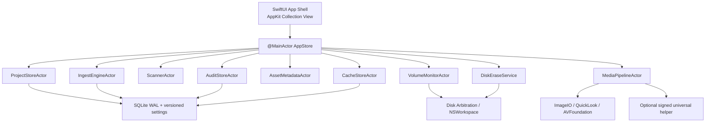
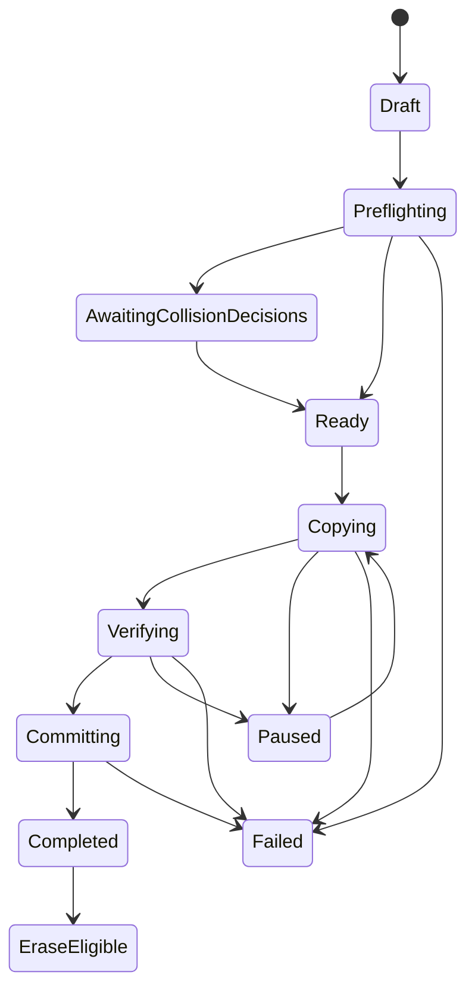

# Swift / macOS再設計

## 1. 再設計の前提

新アプリは「現行Flet画面をSwiftUIで描き直す」だけの移植にはしません。業務語彙、見た目、操作順、既定値、アーカイブ互換を保持しつつ、データの正しさを保証するcoreを先に構築します。

### 維持するもの

- 取り込み／評価・タグの2つの素材ワークスペース
- 暗色UI、上部モード切替、左sidebar、中央素材領域、右シーン／inspector、下部主操作
- Photo／Movie／Raw／Audioのcategory filter
- 4日＋その他のシーン運用
- 会場、撮影者、カードID、日付、シーンによる命名
- grid／list、thumbnail size、sort、multi-select、keyboard操作
- 静止画preview、動画再生、hover scrub、metadata
- プロジェクト、list管理、除外、cache、履歴
- 外部メディア検出、安全な取り出し
- Adobe互換レーティングとmacOS Finderカラータグ

### 変更するもの

- indexではなくUUIDで素材とシーンを関連付ける
- 「copy成功」を永続manifest＋内容hashで定義する
- 既存同名を無条件skipしない
- 操作開始時に不変の計画snapshotを作る
- 全file I/Oをactorへ閉じ、UIは`@MainActor`だけで更新する
- cacheに統一quota／LRU／memory pressure対応を持たせる
- volumeを表示名ではなくstable identityで扱う
- カード初期化を実装し、認可をverified receiptに結び付いた一回限りtokenへする
- 未署名updaterとquarantine解除launcherを廃止する
- Developer ID署名、公証、stapleをrelease gateにする

## 2. 設計原則

1. **正しさが表示より先**: UIに「完了」と出す条件を、domain stateが一意に決める。
2. **安定ID**: array index、表示名、mount path、filenameをidentityにしない。
3. **不変計画**: copy開始後に設定、sort、選択、volume状態が変わっても、そのrunへ影響させない。
4. **単一writer**: file system、settings、history、cache indexには、それぞれ1つのactorだけが書く。
5. **永続状態機械**: crashしても「どこまで終わったか」をSQLiteから復元できる。
6. **final名へ未検証dataを置かない**: `.partial`→検証→atomic commit。
7. **破壊操作は別能力**: 取り込み完了表示とerase実行を、UI boolean一つで接続しない。
8. **需要駆動**: 可視素材だけthumbnail／metadataを生成し、画面外Taskはcancelする。
9. **macOS native first**: ImageIO、QuickLookThumbnailing、AVFoundation、Disk Arbitration、NSWorkspaceを優先する。
10. **配布時点で安全**: signing／notarizationを後付けにしない。

## 3. 推奨アーキテクチャ



### 3.1 UI層

`@MainActor AppStore`だけが画面状態を変更します。actorから返る値型eventを受け取り、view stateへ変換します。file URLへ直接`stat`、JSON保存、Process起動をしません。

推奨view構成:

```text
RinkanUMISApp
├─ WorkspaceWindow
│  ├─ HeaderView
│  ├─ ModeSwitcher
│  ├─ IngestWorkspace / RatingWorkspace
│  │  ├─ SidebarView
│  │  ├─ MediaBrowserRepresentable (NSCollectionView)
│  │  └─ ScenePanel / InspectorPanel
│  └─ OperationBar
├─ SettingsWindow
├─ HistoryWindow
└─ OnboardingWindow
```

通常のform、sidebar、settings、dialogはSwiftUIで十分です。素材gridは数百〜数万件のcell再利用、選択、keyboard、range selection、Drag & Drop、diffable updateが重要なので、`NSCollectionView`を`NSViewRepresentable`で包む構成を推奨します。list表示も同じsnapshotとselection modelを使い、grid/list両方のcontrolを同時保持しません。

### 3.2 Actorと責務

| Component | 唯一の責務 |
|---|---|
| `ProjectStoreActor` | versioned project settings、catalog参照、migration、deep validation、atomic save。sceneを直接変更しない |
| `SceneCatalogStoreActor` | projectごとのScene Catalogを変更できる唯一のowner、authority、revision、snapshot、high-water mark |
| `VolumeMonitorActor` | volume lifecycle、stable identity、mount generation、eject state |
| `ScannerActor` | incremental enumeration、classification、source fingerprint、cancel |
| `IngestEngineActor` | immutable plan、copy、hash、journal、commit、resume／rollback |
| `AssetMetadataActor` | Adobe XMP Rating、Finderカラー、形式別handler、identity再検証、個別結果 |
| `RenameEngineActor` | 既存folderのcopy-and-rename／in-place rename、dry-run、rollback |
| `MediaPipelineActor` | thumbnail、preview、duration、codec、proxy、scrub |
| `CacheStoreActor` | memory/disk cache、quota、LRU、purge、index |
| `OperationStoreActor` | 同一SQLite内でjob／item state、audit、SD outboxを一transaction commitする唯一のwriter |
| `AuditStoreActor` | OperationStoreにcommit済みのrun／item／erase／eject監査をquery／exportするread facade |
| `DiskEraseService` | 一回限りauthorization tokenを検証し、破壊操作を実行 |
| `SceneCatalogSyncActor` | SceneCatalogStoreのcommit済みsnapshotをLAN transportでpublish／fetchする。sceneを独自所有しない |
| `SDManagementSyncActor` | OperationStoreにcommit済みoutboxをclaim／送信／ACKする。domain eventから新規outboxを書かない |
| `UpdateService` | 初版ではなし。将来の署名付き更新だけを独立実装 |
| `AEAssetService` | 任意JSXの説明／Finder表示／export。業務coreから分離 |

## 4. Domain model

### 4.1 Identity

```swift
struct ProjectID: Hashable, Codable { let rawValue: UUID }
struct SceneID: Hashable, Codable { let rawValue: UUID }
struct MediaAssetID: Hashable, Codable { let rawValue: UUID }
struct SourceVolumeID: Hashable, Codable { let rawValue: UUID }
struct IngestRunID: Hashable, Codable { let rawValue: UUID }
```

実装時はtyped ID packageを入れず、上記の軽いwrapperで十分です。sort orderとidentityを完全に分けます。

### 4.2 Project

```text
Project
  id, name, schemaVersion
  destinationBookmark / canonicalURL
  categories[]
  catalogID / authorityMode / adoptedCatalogVersionRef
  photographers[]
  cardNoDefinitions[]
  locations[]
  exclusions
  namingPolicy
  selectionPolicy
  uiPreferences
```

Scene Catalogの可変正本は`SceneCatalogStoreActor`だけが所有し、`ProjectStoreActor`／`Project`からscene rowを直接書き換えません。client snapshotはread-only cacheです。`Scene`は`id, day, order, displayName`を持ち、番号変更や並び替えでIDは変えません。撮影者／Card No定義／会場も、display stringだけでなくIDを持たせます。

### 4.3 SourceVolume

```text
SourceVolume
  id
  volumeUUID / mediaUUID
  bsdName
  wholeDiskBSDName
  mountURL
  displayName
  capacity
  fileSystem
  isInternal, isRemovable, isEjectable, isNetwork, isDiskImage
  mountSessionID / insertionGeneration
  identityStrength / attributeProvenance
  state
```

`displayName`は表示にだけ使用し、security decisionには使いません。再挿入時は同じVolume UUIDでも`insertionGeneration`を増やし、過去runの消去認可を失効させます。

### 4.4 MediaAsset

```text
MediaAsset
  id
  sourceVolumeID
  relativePath
  fileResourceIdentifier
  canonicalURL
  originalName
  extension
  byteSize
  modifiedAt
  capturedAt
  categoryID
  fingerprint
  metadataState
```

`Assignment(assetID, sceneID)`を唯一の割当正本にします。selection、sort、filterはview stateです。`assigned_scene`と`scene_assignments`の二重管理をしません。

### 4.5 IngestPlan

取り込み開始ボタンを押した時点で、現在のProject、volume、assignment、naming policy、destinationを値として凍結します。

```text
IngestPlan
  runID
  projectSnapshot
  catalogVersionRef { projectID, catalogID, authorityID, authorityEpoch, revision, payloadDigest }
  sourceVolumeSnapshot
  destinationSnapshot
  createdAt
  items[]

IngestPlanItem
  itemID
  assetSnapshot
  sceneSnapshot { sceneID, entityVersion, display fields, catalogVersionRef }
  sourceURL
  finalURL
  partialURL
  expectedSize
  sourceFingerprint
  collisionDecision
```

UIでsortや設定を変更しても、実行中planは変わりません。変更は次runから反映します。

## 5. 取り込み状態機械



`EraseEligible`は単純なstored booleanではなく、次を満たす場合だけ計算される派生状態です。

- `RequiredAssetSet`と`RequiredDeliverySet`がともに空ではなく、durable receiptが1件以上ある
- source volume identityと挿入世代が同じ
- source snapshotがcopy中に変化していない
- 全delivery obligationが今回のrunで`durableCommitted`または`durableVerifiedExisting`
- `conflict`、`failed`、`cancelled`、`unverifiedSkip`、`pending`が0件
- SQLite journalとaudit commitがdurable
- 初期化操作時にRequired Setの全sourceと全required destinationを無条件全再読し、SHA-256がcopy receiptと相互一致

この一覧は概要であり、完全なpredicate、耐久性、最終検証、token発行条件は[安全なカード初期化要件](09_安全なカード初期化_フォルダリネーム要件.md)を正本とします。警告を読んで「続行」すれば条件を無視できる設計にはしません。例外運用が必要でもUMIS内に管理者bypass、token発行API、helper経路を作りません。利用者がUMISを終了し、macOSのDisk UtilityをUMIS外で明示操作する案内だけに限定します。

### 5.1 Item状態

```text
planned
preflightPassed
copying
partialWritten
sourceHashed
destinationHashed
verified
durableCommitted
durableVerifiedExisting
conflict
cancelled
failed
rolledBack
```

失敗理由、OS error、retry回数、byte offset、source pre/post fingerprint、hash、final URLをjournalへ保存します。

## 6. Copy engine

### 6.1 推奨手順

1. destination bookmark／権限／空き容量／case sensitivity／filename上限をpreflight
2. source volume identity、file resource ID、size、mtimeをsnapshot
3. 全final pathを先に生成し、同一plan内collisionも検出
4. collision decisionを利用者へ一括提示
5. SQLiteへrunと全itemをtransactionでdurable insert
6. destination filesystem上の同一directoryまたは専用`.umis-partial/<runID>`へ作成
7. bounded chunk copyを行いながらsource SHA-256を計算
8. cancel要求をchunk境界で確認
9. file dataと必要metadataをflush。durability policyに従い`fsync`／`F_FULLFSYNC`
10. partialを再読してdestination SHA-256を計算
11. source pre/post fingerprintを比較。撮影機器が書き込み中なら失敗
12. hashとsize一致後、同一filesystem内でno-replace atomic rename
13. 親directoryをdurable flush
14. journalとauditをdurable commitし、itemを`durableCommitted`へ更新
15. 全item完了後にrunを`completed`へcommit

`FileManager.copyItem`一発では細かなcancel、hash同時計算、progress、partial管理が不足するため、FileHandle／POSIX I/Oを隔離した専用実装にします。copy bufferを再利用し、同時copy数は媒体特性に応じ1〜2本から始めます。SDとNASでは過剰並列が遅くなるため、測定して調整します。

### 6.2 metadata

少なくとも元拡張子、file data、creation／modification dateを保持します。resource fork／xattrを保持するかは実素材で決めます。`com.apple.quarantine`等、source由来の不要xattrをそのままアーカイブへ伝播させるかはpolicy化します。

### 6.3 collision

既存同名は次のいずれかへ必ず分類します。

- `identical`: size＋SHA-256一致を確認した候補。今回のrunでfile／parent durabilityとjournal commitまで完了した場合だけ`durableVerifiedExisting`
- `different`: 同名だがhash不一致。`conflict`
- `incomplete`: `.partial`／過去journalと一致。resumeまたは隔離
- `unknown`: 読取不能。失敗

初版は「同一内容だけ成功扱い、異内容は上書きAPI自体を提供しない」です。異内容時の選択肢は別名保存、対象外としてrun未完了、run中止に限定します。置換は将来のversioned policy、既存data backup／recovery設計、別security reviewを通過するまで追加しません。

### 6.4 naming

`FilenameComponents`を構造化します。

```text
location
sceneCode
sceneName
capturedDate
cardLabel
photographerName
sequence
originalStem
extension
```

previewと実出力は同じpure functionを使用します。path componentはNFC正規化し、空、`.`、`..`、separator、NUL、control、末尾space、過長名を拒否します。`standardizedFileURL`とsymlink解決後にdestination root配下であることを再確認します。case-insensitive／NFC-NFD同一視を含むcollision testを行います。

## 7. 評価・タグとAsset Metadata engine

旧アプリの「選別」フォルダへの複製とセレクト用シーン移動は、2026-08-29の製品判断でSwift版から削除しました。その代わりに、取り込み済みアーカイブを非破壊で絞り込める次のメタデータ操作を提供します。

1. Adobe XMP Basic `xmp:Rating`のReject（`-1`）、未評価（`0`）、星1〜5
2. `NSWorkspace`の動的な表示色と、凍結rootから解決したexact file descriptorのFinderInfo label bitによるFinderカラー
3. 複数選択への一括設定、個別成功／失敗表示、再読込
4. AdobeとFinderのラベルは別物として保存し、自動相互変換しない

評価対象は取り外し可能メディアと現在の取り込み元を拒否します。スキャン時の各file fingerprint、root device/inode、volume UUIDを保持し、読み書きの直前／直後に再検証します。取り込み、リネーム、カード取り出し／初期化、メタデータ書込は同時実行しません。詳細は`13_評価_Finderカラー_AdobeXMP要件.md`を参照します。

## 8. Scanner

### 8.1 incremental scan

- iterative directory enumerationで再帰上限を避ける
- 1回の走査でcountとasset構築を進める
- 50〜200件単位で`AsyncStream<[MediaAssetSummary]>`をUIへ返す
- directory／file単位でTask cancellationを確認
- hidden、configured exclusion、package、symlink policyを明示
- errorを空folder扱いせず、partial resultとerror listを返す
- 0件、読取不能、media交換を別状態にする

800件閾値はUX policyとして残せますが、全treeを先に二重走査しません。早期にtop folder summaryを出し、利用者が絞り込めるようにします。

### 8.2 Finder Drag & Drop

現行Helpにあるのに実装されていないため、Swift版では次のどちらかを仕様として明示します。

- 実装する: folder／file URLをdropし、source rootとしてscan。外部volume同様にread-only扱い
- 実装しない: Helpから記載を削除

利便性向上として実装を推奨しますが、取り込みrunにはstable source snapshotとpermission bookmarkが必要です。

## 9. Media pipeline

### 9.1 Native first matrix

| 機能 | 第一選択 | fallback |
|---|---|---|
| JPEG/PNG/TIFF/HEIC thumbnail | ImageIO `CGImageSourceCreateThumbnailAtIndex` | QuickLookThumbnailing |
| RAW thumbnail | QuickLookThumbnailing／ImageIO | `CIRAWFilter`、必要時helper |
| Movie metadata | AVFoundation `AVAsset` | `MediaCompatibilityHelper.metadata` |
| Movie poster/scrub | `AVAssetImageGenerator` | `MediaCompatibilityHelper.poster／scrub` |
| Movie playback | AVKit／AVPlayer | 互換proxy |
| Audio playback/metadata | AVFoundation | helper |
| File preview fallback | QuickLookThumbnailing | generic icon |

AVFoundationが常に扱えるとは限らない`.mxf .mkv .mts .avi`と、OS／camera support差があるRAWは固定実素材corpusで操作単位に検証します。必要なoperationだけhelperへ送り、標準`.mov/.mp4/.m4a`の正常なoperationでhelperを起動しません。独立`ffprobe`／`ffmpeg` binaryの同梱を要件とはせず、最終corpusで本当に必要な実装だけを`MediaCompatibilityHelper`境界へ収めます。

### 9.2 concurrency

- actor内部のbounded task group
- thumbnailは可視cell優先、prefetch windowは前後数画面だけ
- cell非表示でTask cancel
- previewは選択tokenを持ち、古い結果をUIへ適用しない
- movie proxyは同時1本から開始
- helper Processは専用process group、timeout、stderr上限、cancel、exit cleanupを持つ
- file単位に`autoreleasepool`

### 9.3 decoded image memory

`NSCache.totalCostLimit`は厳密な上限ではないため、cache actorがdecoded pixel bytesを追跡する明示LRUを正本にします。`NSCache`を併用してもそのevictionだけへ依存しません。表示サイズ以上のbitmapをdecodeせず、memory pressure notification、mode変更、project変更で優先度の低いdecoded imageを解放します。詳細は[macOSネイティブ・メディア最適化要件](08_macOSネイティブ_メディア最適化要件.md)を正本とします。

## 10. Cache design

原則は `~/Library/Caches/<bundle-id>/` へ集約します。共有NASアーカイブへ利用者ごとの隠しcacheを自動作成しません。

```text
CacheEntry
  key
  sourceFingerprint
  kind: thumbnail / preview / proxy / scrub / metadata
  fileURL
  byteSize
  createdAt
  lastAccessAt
  generatorVersion
  validationState
```

全kind合計のhard capに加え、thumbnail／preview／scrub／waveform／proxy別のreserved／soft budgetを持ちます。proxyがthumbnailを全evictしない二層quotaとし、segmented／近似LRUのaccess更新はmemoryでcoalesceしてSQLiteへbatch flushします。合計値と配分はreference corpusで確定し、`5GiB`を固定defaultにはしません。「すべて削除」はdisk、SQLite index、decoded memoryを同時にpurgeします。

cache fileはtmp＋validation＋atomic renameです。Quick Lookはrequestごとの一時directoryまたはAPI返却imageを使い、basename globをしません。

## 11. Settings、History、Audit

### 11.1 Settings

- `schemaVersion`付きCodable model
- deep validation
- versionごとの明示migration
- UI編集中はmemory stateを更新
- debounce後に`ProjectStoreActor`が保存
- settings windowのCancelは編集copyを捨て、Applyで一括commit
- atomic replace＋durable flush
- main、backup複数世代、破損時のrecovery UI

SwiftDataは最低macOSを14以上へ上げる場合だけ候補にします。古いIntelを含む可能性があるため、現時点ではSQLite storeまたはCore Data SQLite storeを推奨します。file copy journalとauditにはSQLite WALを使います。

### 11.2 HistoryとAudit

成功runだけでなく、run開始、preflight、各item、cancel、retry、collision判断、eject、eraseを記録します。履歴画面はSQLite queryでfilterし、UI controlを未接続にしません。

旧history JSONは`legacyImported`として取り込み、元JSONはread-onlyで保持します。旧履歴にhashやitem明細がないことをUIへ明示します。

### 11.3 Privacy

- OSLogのpath、撮影者、カードIDは`privacy: .private`
- diagnostic exportは利用者が明示実行
- export前にfull path／usernameをredactできる
- log retention、audit retention、cache quotaを設定に明記
- crash logを無期限に増やさない

## 12. Volume、Eject、Erase

### 12.1 Volume monitor

Disk ArbitrationとNSWorkspace mount notificationを使い、pollを主手段にしません。eventごとにidentity snapshotを作り、同名カードを完全に分けます。

物理カードのscan開始時identityは、結果公開までdestructive capabilityとして公開しません。一方で、非公開のin-flight identityとscan世代を保持し、`disappeared` eventは公開済みidentityとin-flight identityの双方に対して`SourceVolumeID + arrivalGeneration`を照合します。scan結果を採用する直前にはDisk Arbitrationのcurrent identityとmount-session registryを開始時snapshotへ再照合し、ID、挿入世代、全identity証拠digest、canonical mount、scan source ID、root／items走査範囲が一致することを必須とします。予期しない抜去後のmedia pipeline再開では同じ照合をresume前後の両方で行い、後段で変化した場合は直ちに再停止して新しい隔離世代を開始します。非同期待機から戻った旧scanが別のin-flight世代を破棄することを禁止し、identity failure用の隔離世代は最初のawait前に置換します。await後のphase／status更新にもfailure世代と隔離世代の所有権一致を要求します。

media pipelineのsuspend／resumeは単調revisionへ結び付けます。obsolete scanが安全確認のため遅れてsuspendした場合、そのsuspend tokenがなおcurrentで、AppModel上にも新しい隔離、cache消去、review書込み、destructive quarantineが存在しない場合だけ条件付きresumeを許可します。後発所有者のsuspend／resumeでtokenが失効した場合、旧scanはpipeline状態を変更しません。条件付きresumeのactor hop後にもAppModel policyを再評価します。

UI media cardには次を表示します。

- volume label
- 容量
- removable／ejectable種別
- filesystem
- Volume UUID末尾4〜6文字
- status: connected／scanning／copying／ejecting／error

### 12.2 Eject

copy中は通常ejectをdisabledにします。利用者がcancelしてjournalを安全状態へcommitした後にejectします。Disk Arbitration completion callbackが成功した後でUI stateをremovedへします。失敗時はvolumeを残し、`.ejectFailed(error)`としてretry可能にします。

### 12.3 Erase

カード初期化は製品要件として実装します。ただし、次を満たさないbuildでは機能を有効化しません。

- `DiskEraseService`以外は実行できない
- `EraseAuthorizationToken`はrunとvolume identityへ結び付く
- internal、network、disk image、Time Machine対象等を強制拒否
- 実行直前にUUID、whole disk、容量、挿入世代、removableを再照合
- tokenを一回で消費
- 非破壊の`最終検証を開始`でRequired Set sourceと全required destinationを無条件全再読SHA-256し、結果を表示しても自動初期化しない。freshな検証結果を利用者が別のred buttonで承認した後、source I/O停止、normal unmount、物理media再照合を通過した時だけauthenticated tokenを発行し、同じserial workflowで即消費
- `diskutil`を使うならabsolute path、argument array、structured plistで確認。開始前timeout／起動失敗と開始後watchdogを分離する
- destructive command開始後のtimeoutは`OutcomeUnknown`とし、processを強制終了せず、自動再実行せず、device operation lockを保持する
- CIはproduction gateから到達不能なtest-only executorでsparse disk imageを使い、release前は専用犠牲SD card／readerでmanual hardware QAを行う
- 成否と対象identityをauditへ保存
- 「緊急モード」を永続設定にしない

初版は単一leaf volumeのExFAT初期化に限定し、multi-partition media、whole-disk repartition、属性不明mediaを拒否します。Required Set、保存先再読SHA-256、final rescan、destination identity、one-shot tokenの詳細は[安全なカード初期化要件](09_安全なカード初期化_フォルダリネーム要件.md)を正本とします。

## 13. UI再設計

### 13.1 全体レイアウト

現行の空間配置は維持します。

```text
┌──────────────── Header / Mode Switch / Help / Settings ────────────────┐
│ ┌──────── Sidebar ────────┐ ┌──────── Media Browser ───────┐ ┌──────┐ │
│ │ Project / destination   │ │ Grid or List                 │ │Scene │ │
│ │ Location / identity     │ │ filters / sort / selection  │ │or    │ │
│ │ Source media            │ │ thumbnail / badges          │ │Info  │ │
│ └─────────────────────────┘ └──────────────────────────────┘ └──────┘ │
├──────────────── Operation status / primary action ─────────────────────┤
└─────────────────────────────────────────────────────────────────────────┘
```

### 13.2 改善点

- 最初のrun前に短いonboardingを自動表示
- 取り込み開始前に「計画確認」sheetを追加
- source media cardにstable identity情報を追加
- 割当件数はdomain Assignment queryから算出
- 完了結果を`durableCommitted / durableVerifiedExisting / conflict / failed / cancelled`で分ける
- `verified N/N`が100%になるまでerase導線を表示しない
- copy中のcancel動作を「現在chunkで停止」等、正確に表記
- non-blocking operation panelを設け、画面切替でも進捗を保持
- SettingsはApply／Cancel modelにする
- Help文言と実button名を同一sourceから生成
- file DnDを実装するか、Helpから削除
- hidden mediaをmedia pickerから復元可能にする
- error rowにRetry、Finder表示、診断exportを付ける
- 全interactive elementへaccessibility role／label／value／hintを付ける

### 13.3 KeyboardとAccessibility

- ⌘A: filter内全選択
- Shift+click／Shift+矢印: range selection
- Space: Quick Look相当preview
- Return: default actionまたはscene assign
- Escape: modal cancel。ただし非同期continuationを失わない
- Full Keyboard Accessで全設定を操作可能
- VoiceOverでfile name、category、duration、assignment、selected stateを読み上げ
- Reduce Motionでhover animation／transitionを抑制
- Increase Contrast／Dynamic Type相当のmacOS text sizeへ対応

## 14. 対応OSとCPU

### 暫定方針

- 配布binary: universal2（arm64＋x86_64）
- App本体、framework、helperすべて同じarchitecture set
- 最低macOS: 実利用Mac一覧を採取して確定
- SwiftDataを前提にしない
- AppKit collection view、ImageIO、AVFoundation、Disk Arbitration等、古いOSでも安定したAPIを中心にする

最低macOSを先に推測で固定すると、「古いMac対応」と新API利用のどちらかを後で壊します。実利用機のmodel identifier、CPU、RAM、macOS versionを収集し、2台以上の最低spec reference machineを決めてからDeployment Targetを固定します。

候補としてはmacOS 12／13以降を比較し、Appleのsecurity support、Xcode toolchain、RAW support、SwiftUI差、利用現場の実機を併せて判断します。

## 15. Sandboxと配布形態

直接配布を前提とする場合、初版は次を推奨します。

- Developer ID distribution
- Hardened Runtime
- notarization
- App SandboxはOFF
- entitlementは必要最小限
- source／destination選択はNSOpenPanel
- persistent pathはbookmarkで保持

Mac App StoreはApp Sandboxが必須です。removable mediaの自動発見、NAS、任意folder、`diskutil`、管理者permission修復との整合を大きく再設計する必要があります。Appleも、App Store外公証ではHardened Runtimeが必須で、App Sandboxはoptionalとしています。[Preparing your app for distribution](https://developer.apple.com/documentation/xcode/preparing-your-app-for-distribution)

## 16. FFmpegと第三者依存

### 推奨順

1. Apple frameworkだけで扱う
2. OS Quick Lookが扱える場合はQuickLookThumbnailing
3. native機能／必須性能gapが固定corpusで実証されたoperationだけ、署名済みout-of-process helper

helperを残す場合:

- universal2、またはarch別helperをbundle内で明示選択
- Developer IDで内側から署名
- Hardened Runtimeで動作確認
- source URL、version、SHA-256、configure lineをlock
- license text、attribution、対応source／offer、SBOMを配布物へ含める
- baselineは`--enable-gpl`／`--enable-nonfree`／libx264／libx265なしの再現可能な最小LGPL構成。GPL構成は製品全体の配布条件を含む別Decision Recordと独立release gateなしに採用しない
- network downloadや環境変数overrideを配布版では禁止

## 17. 更新

初版は自動更新なしでよいです。署名・公証済みDMGを配布し、アプリは更新ページを開くだけにします。

将来自動更新するなら:

- App Store、または署名付きupdate framework
- feed metadataとartifactの暗号署名
- Developer ID署名＋公証済みartifact
- semantic version比較
- downgrade／rollback attack防止
- download size／content type／timeout
- staged rolloutとrecovery
- updater自体も署名対象

任意shellでapp bundle内部を書き換えません。

## 18. 推奨Xcode project構成

```text
RinkanUMIS.xcodeproj
Packages/
Sources/
  App/
  Features/
    Ingest/
    Select/
    Projects/
    Settings/
    History/
    Onboarding/
  Domain/
    Models/
    Naming/
    StateMachines/
  Services/
    VolumeMonitor/
    Scanner/
    IngestEngine/
    ArchiveEngine/
    RenameEngine/
    MediaPipeline/
    CacheStore/
    DiskErase/
    SceneCatalogSync/
    SDManagementGateway/
  Persistence/
    SQLite/
    OperationStore/
    SceneCatalogStore/
    Migrations/
  Platform/
    AppKit/
    DiskArbitration/
    OSLog/
  Resources/
    Assets.xcassets/
    Localizable.xcstrings
    AfterEffectsScripts/   # 採用する場合のみ
Tests/
  DomainTests/
  IngestEngineTests/
  PersistenceTests/
  MediaCompatibilityTests/
  VolumeSafetyTests/
  MigrationTests/
  UITests/
Fixtures/
  LegacyProjects/
  LegacyHistory/
  MediaCorpus/
```

第三者packageを増やしすぎず、domainとcopy engineはFoundation、CryptoKit、SQLite境界でtest可能にします。

## 19. 暫定性能予算

最低対応機で測定する合格基準の初案です。

| 項目 | 目標 |
|---|---|
| 初期window表示 | 500ms以内 |
| cold launch p95 | 2秒以内 |
| warm launch | 1秒以内 |
| operation完了後5秒idleのaggregate RSS | main app＋全XPC／helperで100MiB以下の初期目標 |
| 320 mixed asset、warm disk／memory cold、全visible処理後aggregate RSS | 180MiB目標、基準機確定前の暫定上限250MiB |
| mode切替p95 | 200ms以内 |
| MainActor連続占有 | 50ms未満 |
| 10,000件snapshotの先頭200 ID | 300ms以内 |
| scan cancel反応 | 200ms以内を目標 |
| 100回mode/media往復、終了60秒後のaggregate RSS増加 | 20MiB以内 |
| decoded image memory | 明示上限。初案128MB |
| disk cache | kind別reserved／soft budget＋全kind合計hard cap。値はreference corpusで確定 |
| copy throughput | hashを除くcopy部分で基準copyの80%以上 |
| 未検証itemがあるerase許可 | 0件 |

これらは実機採取後に調整します。測定定義と詳細gateは[macOSネイティブ・メディア最適化要件](08_macOSネイティブ_メディア最適化要件.md)を正本とします。速さのためにhashやdurabilityを省略しません。copy phaseとverify phaseを別表示し、利用者へ正確な残時間を伝えます。
