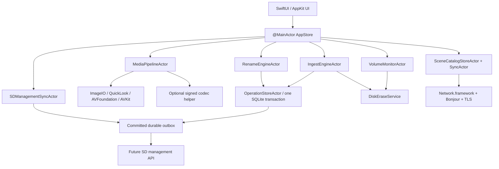

# 追加要件定義：ネイティブ最適化・安全な初期化・フォルダリネーム・連携

作成日: 2026-08-26  
文書状態: 実装前レビュー用 v1.0  
対象: macOS専用Swift版 RINKAN UMIS

## 1. この文書の位置付け

本書は、現行Flet／Python版の解析後に追加された製品要求を、実装可否を判定できる形式へ落とした上位要件です。詳細は次の文書へ分割します。

- [08_macOSネイティブ_メディア最適化要件.md](08_macOSネイティブ_メディア最適化要件.md)
- [09_安全なカード初期化_フォルダリネーム要件.md](09_安全なカード初期化_フォルダリネーム要件.md)
- [10_LANシーン共有_SD管理連携要件.md](10_LANシーン共有_SD管理連携要件.md)
- [11_SD管理システム実装監査_UMIS連携差分.md](11_SD管理システム実装監査_UMIS連携差分.md)
- [12_SD管理連携_不足資料_判断チェックリスト.md](12_SD管理連携_不足資料_判断チェックリスト.md)

既存の[Swift / macOS再設計](04_Swift_macOS再設計.md)と[移行・検証・署名公証計画](05_移行_検証_署名公証計画.md)に対し、本書の確定事項を優先します。

## 2. 今回確定した製品判断

| Decision ID | 決定 |
|---|---|
| DEC-001 | Flet、Python、Pillow、flet-video等は新アプリへ持ち込まず、Apple純正frameworkを第一選択にする |
| DEC-002 | サムネイル、静止画表示、RAW表示、動画再生、動画poster／scrubを最優先の性能領域にする |
| DEC-003 | FFmpeg／ffprobeは標準経路から外し、必要機能をApple APIが提供できない、または固定corpus／reference Macで必須性能を満たせないoperationだけの任意helperに縮小する |
| DEC-004 | カード初期化はSwift版へ実装する。ただし検証済み取り込みから導出される一回限り認可なしでは実行不能にする |
| DEC-005 | 永続的な緊急初期化、警告無視、表示名だけの認可、未検証skipを成功とする経路は実装しない |
| DEC-006 | 既存フォルダをsourceにしたリネーム機能を追加する。初回productionは「別フォルダへ検証付きコピー」だけを有効化し、同一場所でのrenameは専用fault／recovery gate通過後の上級機能とする |
| DEC-007 | マスターMacを唯一の公開主体とするLAN内シーンカタログ共有を導入する |
| DEC-008 | 受領・監査済みSD管理システムとの連携は交換可能なgatewayと永続outboxへ隔離する。現行browser APIは流用せず、SD側へversioned integration API、device service auth、server idempotencyを新設する |
| DEC-009 | LAN／VPSから受け取った情報は、実行中の取り込み計画やローカルの初期化安全判定を上書きしない |
| DEC-010 | 新Swift版と全helperはDeveloper ID署名、Hardened Runtime、公証、stapleをrelease gateにする |

## 3. 製品目標

### GOAL-001：macOS最適化

利用可能な処理はImageIO、QuickLookThumbnailing、Core Image、AVFoundation、AVKit、VideoToolbox、Core Video、Metal、AppKit、Disk Arbitration、Network.frameworkへ置き換えます。外部commandをApple APIの代わりとして常用しません。

### GOAL-002：大量素材でも操作を止めない

素材数に比例して全サムネイル、全view、全metadataを一括生成しません。可視範囲、選択中素材、近傍prefetchの順に処理し、スクロールやモード切替を最優先します。

### GOAL-003：原本を消す判断を数学的に再現可能にする

「必要なデータがコピーされた」は、件数表示やファイル存在ではなく、確定したRequired Set、source hash、保存先再読hash、永続journal、manifest digestから判定します。同じ入力と記録から後日再監査できることを求めます。

### GOAL-004：リネームを破壊操作にしない

全出力名を先に計画し、衝突、Unicode、case sensitivity、sidecar、cycleを解決してから実行します。途中終了後にresume／rollbackでき、黙って上書きしません。

### GOAL-005：複数Macで同じシーン定義を利用する

マスターが発行したrevision付きsnapshotを各clientが検証・保存し、offlineでも最後の正常snapshotを使用します。作業中の取り込みは開始時revisionへ固定します。

### GOAL-006：VPS連携を安全に追加できる

Card Noから撮影者／シーンを解決し、取り込み状態を返す機能を、copy engineやUIへ直接埋め込みません。network障害でもローカル取り込みを壊さず、状態通知を再送可能にします。

## 4. 対象範囲

### 4.1 今回の設計対象

- 同梱runtime／library／commandの置換方針
- thumbnail、still、RAW、movie、audioの表示・再生pipeline
- 大量素材browser、prefetch、memory／disk cache、キャンセル
- verified ingestとカード初期化authorization
- removable mediaの識別、erase実行、事後検証、監査
- 既存folderのcopy-and-rename／in-place rename
- LAN scene catalogのmaster publish／client sync
- SD管理APIのadapter、outbox、状態model、security boundary
- 追加要件の性能、信頼性、セキュリティ、受入条件

### 4.2 今回実装しないもの

- Swift／Xcode project本体
- 実カードのformat
- 実NASへの書込み
- マスター／client間の本通信
- VPS上SD管理システムへの実接続
- 未実装のSD管理external endpoint、認証方式、field mappingのserver実装
- 非対応codec helperの採否確定。実メディアcorpus試験後に決める

## 5. 用語

| 用語 | 定義 |
|---|---|
| Discovered Set | 走査で発見した全regular fileと走査errorの集合 |
| Required Set | ユーザーが今回保全すると確定したfile／sidecarの不変集合 |
| Excluded Set | ユーザーが理由付きで明示除外した集合。暗黙除外を含めない |
| Verified Item | source SHA-256と、close／flush後に保存先から再読したSHA-256が一致したitem |
| Durable Committed | 新規copyの内容一致、file／parent durability、journal commitまで今回runで完了したdelivery obligation |
| Durable Verified Existing | 既存同名のidentity、全内容一致、file／parent durability、journal commitまで今回runで再確認したdelivery obligation |
| Ingest Receipt | run、source、destination、Required Set、item結果、manifest digestを記録した監査証跡 |
| Erase Authorization | 特定run・特定挿入世代・特定物理mediaだけに使える短寿命・一回限りの能力token |
| Card No | 業務上のカード識別子。Volume UUIDやBSD disk IDとは別物 |
| Source Volume Identity | security判断に使うVolume UUID、media identity、whole-disk BSD ID、容量、属性、挿入世代の組 |
| Scene Catalog | Scene ID、日、表示順、名前等を持つrevision付き共有snapshot |
| Catalog Master | Scene Catalogを書き換え、publishできる唯一のMac |
| SD Management Gateway | 将来のVPS APIをdomainから隔離するprotocol／adapter |

## 6. システム構成

重要な依存方向:

- `DiskEraseService`はUI booleanを受け取りません。verified receiptから生成したtokenだけを受け取ります。
- `SceneCatalogStoreActor`だけがcatalogの可変正本です。`SceneCatalogSyncActor`はcommit済みsnapshotのtransportであり、実行中`IngestPlan`を変更しません。
- `OperationStoreActor`がjob state、audit、outboxを同じSQLite transactionで確定します。`SDManagementSyncActor`はcommit済みoutboxをclaim／送信するだけで、domain event受領後に別transactionでoutboxを新規作成しません。
- Media pipelineの失敗はpreview qualityを下げても、copy対象やhash判定を変えません。

## 7. 上位機能要件

| Requirement ID | 必須要件 | 優先度 |
|---|---|---|
| SYS-001 | appはPython／Flet runtimeなしでclean macOS user上に起動する | Must |
| SYS-002 | main app processへunsigned／downloaded executable codeを読み込まない | Must |
| SYS-003 | file／scene／run／catalog／deviceは表示順や表示名でなくstable IDを使う | Must |
| SYS-004 | UIから同期file I/O、hash、metadata decode、Process waitを行わない | Must |
| SYS-005 | 実行開始時に設定と対象のimmutable planを確定する | Must |
| SYS-006 | copy、rename、move、erase、network syncをitem／event単位で監査する | Must |
| MED-001 | 可視cellを最優先するnative thumbnail pipelineを提供する | Must |
| MED-002 | still画像をviewportに必要なpixel数でdownsampleする | Must |
| MED-003 | movie／audioはAVPlayer／AVPlayerViewを第一選択にする | Must |
| MED-004 | native機能／必須性能gapが実証されたoperationだけを署名済みhelperへ送り、正常なnative operationは維持する | Must |
| MED-005 | decoded memoryとdisk cacheにhard budgetとpressure対応を持つ | Must |
| ING-001 | source→destination `.partial`の一段copyとstreaming SHA-256を使う | Must |
| ING-002 | destinationを再読してhash一致後にだけfinal commitする | Must |
| ING-003 | 既存同名を`identical／different／unknown`へ分類する | Must |
| ERA-001 | 非空のRequired Asset／Delivery Setと1件以上のdurable receiptを必須とし、全delivery obligationが今回runの`durableCommitted`または`durableVerifiedExisting`でなければerase tokenを発行しない | Must |
| ERA-002 | tokenはrun、manifest digest、Source Volume Identity、挿入世代へ結合する | Must |
| ERA-003 | erase直前に同一物理mediaを再識別し、差があれば中止する | Must |
| ERA-004 | internal、network、disk image、非removable、不明階層を拒否する | Must |
| ERA-005 | 緊急bypassを通常版へ実装しない | Must |
| REN-001 | 既存folderを再帰／非再帰でscanし、実行前に全rename結果をpreviewする | Must |
| REN-002 | copy-and-renameを既定とし、sourceを変更しない | Must |
| REN-003 | in-place renameはjournal、no-replace、resume／rollbackを必須にする | Must |
| LAN-001 | masterだけがScene Catalogをpublishできる | Must |
| LAN-002 | clientはrevision、schema、digest、publisher identityを検証する | Must |
| LAN-003 | offline時は最後に検証済みsnapshotを利用し、stale状態を表示する | Must |
| SDM-001 | Card Noと物理Volume Identityを別modelとして扱う | Must |
| SDM-002 | 将来APIを`SDManagementGateway`の外へ漏らさない | Must |
| SDM-003 | 状態通知はdurable outbox、idempotency key、retryを持つ | Must |
| SDM-004 | remote応答はlocal copy verificationを代替または弱化できない | Must |

## 8. 現行重大欠陥への対応trace

| 現行欠陥 | 新設計の強制条件 |
|---|---|
| scene assignmentがarray index | `Assignment(MediaAssetID, SceneID)`のみを正本にする |
| sort後に別fileをcopy | planはstable IDで解決し、sortはview stateだけ |
| `verify_checksum`未使用 | SHA-256をcopy primitiveの必須処理にする。OFF設定を作らない |
| 同名存在だけで成功skip | 今回runでidentity、全内容hash、file／parent durability、journal commitまで再検証した場合だけ`durableVerifiedExisting`。異内容はconflict |
| finalへ直接copy | destination上の`.partial`へ書き、verify後no-replace commit |
| fail 0ならformat可 | 非空Required Set、全delivery obligationのdurable receipt、初期化操作時のsource／destination全再hash等を含む[安全なカード初期化要件](09_安全なカード初期化_フォルダリネーム要件.md)の完全predicateからtokenを導出 |
| display nameでformat対象認可 | Source Volume Identity＋insertion generation＋実行直前再照合 |
| emergency format永続化 | 通常版にbypassなし。tokenなしのservice call自体を型で不能化 |
| sort／設定変更がworkerへ反映 | planを値snapshotとしてfreeze |
| scene moveで上書き | 全件preflight＋no-replace＋transaction journal |
| Select cancelが無効 | structured Task cancellationを実処理へ接続 |
| eject前にUI state消去 | Disk Arbitration成功callback後だけremovedへ遷移 |
| 設定Cancelが保存済み | draft／apply transaction model |
| path component `..` | canonical root containment、separator／`.`／`..`拒否 |
| updaterが任意code置換 | custom updater削除。署名・公証済みartifact以外を実行しない |

## 9. 非機能要件

### 9.1 性能

- NFR-PERF-001: oldest supported reference Macでcold launch p95 2秒以内を目標とする。
- NFR-PERF-002: main threadの同期作業は1 frame budgetを超えず、50ms超のblockをrelease gateで0件にする。
- NFR-PERF-003: 10,000 assetでも全cell／全thumbnailを同時生成しない。
- NFR-PERF-004: 320 mixed asset、warm disk／memory cold、全visible処理後のmain app＋全XPC／helper aggregate RSSは180MiBを目標、reference hardware確定前は250MiBを暫定上限とし、Phase 0で正式gateを固定する。
- NFR-PERF-005: visible still thumbnailのcache hit表示は1 frame以内、local SSD cold p95は300ms以内を目標とする。
- NFR-PERF-006: H.264／HEVCを一律hardware decode可能と仮定せず、reference corpusをnativeでrealtime再生できるsampleはoriginalを使用し、frame-drop／CPU／thermal基準未達時はまずnative proxy policyへ分類する。
- NFR-PERF-007: mode切替p95 200ms以内、100往復でRSSが単調増加しない。

### 9.2 信頼性

- NFR-REL-001: app kill、Mac再起動、source抜線、destination抜線、disk full後もjournalから状態を判定できる。
- NFR-REL-002: 未検証dataをfinal名へ置かない。
- NFR-REL-003: remote service停止はlocal ingest journalを壊さない。
- NFR-REL-004: media preview failureはingest対象を暗黙除外しない。
- NFR-REL-005: erase結果不明時は再実行せず、対象をlocked stateへ置く。

### 9.3 セキュリティ

- NFR-SEC-001: Developer ID、Hardened Runtime、公証、stapleを必須にする。
- NFR-SEC-002: LAN pairing key、TLS identity、VPS credentialはKeychainへ保存する。
- NFR-SEC-003: Bonjour／LAN通信は明示説明と利用者同意を伴う。
- NFR-SEC-004: LAN publisherの信頼を`projectID + catalogID + authorityID + authorityEpoch + Catalog authority signing key`へ結合し、TLS側ではLAN CA fingerprintとmaster server leaf SPKIを別にpinする。Bonjour名、device表示名、device ID単独をtrust rootにせず、検証済みhandoff chainまたは明示re-pairingだけがpinを更新できる。
- NFR-SEC-005: VPSはHTTPSを必須とし、平文HTTPへfallbackしない。
- NFR-SEC-006: full path、個人名、Card Noを通常logへ平文出力しない。
- NFR-SEC-007: networkから受け取ったpathやfilenameをfile operationへ直接使用しない。

### 9.4 アクセシビリティ

- NFR-A11Y-001: 全操作をkeyboardとFull Keyboard Accessで完結できる。
- NFR-A11Y-002: VoiceOverがfilename、category、scene、verification、sync、erase不可理由を読み上げる。
- NFR-A11Y-003: colorだけでcopy／error／sync stateを区別しない。

## 10. 初版の機能境界

### 初版へ含める

- native media pipeline
- verified ingest engine
- card volume初期化
- copy-and-rename
- in-place renameの設計・test target。初回production releaseではfeature flag OFF／通常到達不能
- LAN Scene Catalog master／client
- SD Management Gatewayのprotocol、release用disabled adapter、outbox schema、DEBUG／test target限定fake server test

### SD管理側integration API実装後に有効化する

- 実Card No検出規則と匿名化fixture
- `/api/integrations/v1` production endpoint
- stable public ID／assignment revisionを含むrequest／response mapping
- Macごとのdevice service authentication
- server idempotency inbox／receipt
- `ingestVerified`と`cardReadyForReuse`を分けたstatus mapping
- stable error code／rate limit／restore reconciliation policy
- production feature flag

## 11. 実装開始前のreview gate

次を満たした後に実装へ進みます。

1. 本書と08〜10の要件にproduct ownerの異議がない。
2. 最低macOS／Intel support方針が暫定でも決まる。
3. 実運用movie／RAW sample corpusを用意できる。
4. `CardFormatProfile`の初版対象を決める。
5. copy-and-rename既定とin-place advancedのUI方針を確認する。
6. LANで共有するfield範囲とmaster端末運用を確認する。
7. Developer ID Application identityをKeychainへ導入できる。

未確定値はadapterやpolicyとして隔離し、copy core、stable identity、journal、media pipelineの実装を止めない構成にします。
