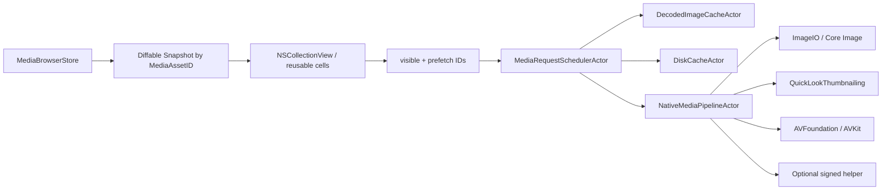

# macOSネイティブ・メディア最適化要件

## 1. 目的

本書は、新Swift版で最優先とするthumbnail生成、静止画／RAW表示、動画／音声再生、scrub、素材browserの性能要件を定義します。目的は単なるlibrary置換ではなく、次の構造的な負荷をなくすことです。

- Python runtime＋Flet／Flutter view processの二重常駐
- 全assetのcontrolを同時生成するUI
- 表示していない素材まで一括thumbnail生成
- source→home temp→destinationの二重copyとは別に増え続けるpreview cache
- qlmanage、sips、ffmpeg等のprocess起動を標準形式にも繰り返す処理
- full-resolution imageを表示サイズ以上にdecodeする処理
- 古いrequestの結果が新しく選択したcellへ戻るrace
- memory pressure時もdecoded bitmapを保持する挙動

## 2. 採用原則

| ID | 原則 |
|---|---|
| MED-ARCH-001 | Apple frameworkで処理できる形式はmain process内のnative APIで処理する |
| MED-ARCH-002 | optional helperは、必要な機能をApple APIが提供できない場合、または固定corpus／reference Macで必須性能を満たせない場合だけに限定する。nativeで正常な機能をhelperへ一括移管しない |
| MED-ARCH-003 | UIへ渡すのはstable `MediaAssetID`と値型stateであり、file pathをcellのidentityにしない |
| MED-ARCH-004 | visible、selected、near-visible、backgroundの優先順位を固定する |
| MED-ARCH-005 | 同じasset／pixel size／representationの同時requestを一つへcoalesceする |
| MED-ARCH-006 | requestはgeneration tokenを持ち、cell再利用後の古い結果を破棄する |
| MED-ARCH-007 | full resolution decodeをthumbnailとして使用しない |
| MED-ARCH-008 | native経路の失敗を「対象fileなし」と解釈しない。preview失敗とingest対象は独立させる |
| MED-ARCH-009 | proxyは必要性を測定してからon-demand生成し、標準形式へ常用しない |
| MED-ARCH-010 | cacheは派生dataであり、消しても正本を再構築できる |

## 3. 同梱依存のDisposition

現行依存は[requirements.txt](legacy-source/requirements.txt:1)と実装の探索結果を基準にしています。

| 現行component | Swift版 | 置換先／条件 |
|---|---|---|
| Python runtime | 削除 | Swift／Foundation |
| Flet／Flet Desktop | 削除 | SwiftUI app shell＋AppKit大量一覧 |
| flet-video | 削除 | AVKit `AVPlayerView`＋AVFoundation `AVPlayer` |
| Pillow | 削除 | ImageIO、Core Graphics、Core Image |
| pillow-heif | 削除 | ImageIO／Core ImageのHEIF support |
| rawpy | 原則削除 | QuickLookThumbnailing、ImageIO、`CIRAWFilter`。実camera非対応時だけLibRaw系helperを再評価 |
| psutil | 削除 | volume列挙／identityはDisk Arbitration、容量は`URLResourceValues.volumeAvailableCapacityForImportantUsage`等、物理memory／thermal／powerはProcessInfo、app＋helperのRSSはMach `task_info`／`proc_pidinfo`境界 |
| qlmanage command | 削除 | QuickLookThumbnailing framework |
| sips command | 削除 | ImageIO／Core Graphics |
| osascript folder chooser | 削除 | NSOpenPanel |
| osascript notification | 削除 | UserNotifications／AppKit notification UI |
| ffprobe | 独立binaryを標準要件にしない | AVAsset async property loading。gapがあるmetadata operationだけ`MediaCompatibilityHelper`へ抽象化 |
| ffmpeg | 標準経路から削除 | AVAssetImageGenerator／AVPlayer／AVAssetReader／AVAssetExportSession。機能または必須性能gapだけ`MediaCompatibilityHelper`へ抽象化 |
| JSON duration cache | 置換 | versioned SQLite cache index |
| Flet cache／runtime extraction | 削除 | 通常のsigned `.app` bundle |

FFmpegは広い形式互換のfallbackとして有力ですが、現行同梱物はFFmpeg 8.1.2のGPL build（`--enable-gpl`、x264／x265有効）であり、そのまま新製品へ継承しません。固定corpusで`.mxf`、`.mkv`、`.mts`、`.avi`等の機能／必須性能gapを操作単位で測定し、必要なoperationだけを署名済み・universal2の`MediaCompatibilityHelper`へ送ります。

helperが必要になった場合のbaselineは、公式sourceからの再現可能な最小LGPL構成（`--enable-gpl`なし、`--enable-nonfree`なし、libx264／libx265なし）です。source archive、version、configure出力、build recipe、SHA-256、license texts、対応source／offer、SBOMをrelease manifestへ固定します。GPL構成へ変更する場合は、製品全体の配布条件を含む別Decision Record、法務確認、独立release gateを必要とし、単なるbuild option変更では許可しません。

形式の振り分けは拡張子だけで決めません。起動時／corpus test時にImageIOが公開するtype identifiers、Quick Lookの実結果、AVFoundationのasset property load・playability・export compatibilityを確認し、`MediaCapabilityRegistry`へ「このOS build／CPUでどの処理が成功したか」を記録します。拡張子は候補抽出にだけ使い、native APIの実結果を最終判定にします。

## 4. Browser architecture



### 4.1 Collection view

- MED-UI-001: gridは`NSCollectionView`を`NSViewRepresentable`でSwiftUIへ統合する。
- MED-UI-002: `NSCollectionViewDiffableDataSource<SectionID, MediaAssetID>`を使用する。
- MED-UI-003: `NSCollectionViewPrefetching`から近傍asset IDをschedulerへ渡す。
- MED-UI-004: grid／list切替で両方のview treeを保持せず、同じsnapshotとselection modelを使う。
- MED-UI-005: sort／filterはID snapshotの差分だけを適用し、thumbnailを作り直さない。
- MED-UI-006: cell configure時はmemory cache lookupまでとし、disk read／decodeをmain threadで行わない。
- MED-UI-007: cell reuse、project切替、source切替でgeneration tokenを更新する。
- MED-UI-008: itemが不可視になった時はvisible priorityを解除し、不要なrequestをcancelする。
- MED-UI-009: selection、scene assignment、star、verification stateは独立badge layerとして部分更新する。
- MED-UI-010: filenameやscene変更で全cell reloadを行わず、対象IDだけreconfigureする。

Appleのmodern collection viewはcell reuse、prefetch data source、diffable data sourceを提供します。[NSCollectionView](https://developer.apple.com/documentation/appkit/nscollectionview) / [NSCollectionViewDiffableDataSource](https://developer.apple.com/documentation/appkit/nscollectionviewdiffabledatasource-axww)

### 4.2 Request priority

| Priority | 対象 | 動作 |
|---|---|---|
| P0 interactive | 現在のpreview、再生開始、Space preview | background requestを一時降格して即開始 |
| P1 visible | 画面内cell | placeholderから段階表示 |
| P2 near visible | 前後1〜2画面のprefetch | scroll方向を優先 |
| P3 background | duration、codec、scrub、proxy | idle／thermal／power状態で制限 |

同一assetのP3 requestがP1へ昇格した場合、別requestを作らず既存workのpriorityを上げます。P0／P1をP3のproxy生成が飢餓状態にしないよう、resource poolを分離します。

## 5. Thumbnail pipeline

### 5.1 共通要求

- MED-THM-001: request keyは`asset fingerprint + representation kind + pixel width + pixel height + color policy + pipeline version`とする。
- MED-THM-002: point sizeではなくscreen backing scaleを含む実pixel sizeで生成する。
- MED-THM-003: 生成画像はcell必要pixelの1.0〜1.25倍以内とし、原寸をdecodeしない。
- MED-THM-004: orientationを適用し、縦横比を保持する。
- MED-THM-005: embedded ICC profile／ColorSyncを尊重し、勝手にprofileを破棄しない。
- MED-THM-006: alphaが必要な形式は保持し、disk cache formatをJPEG固定にしない。
- MED-THM-007: sourceが変更された場合、古いcacheを表示しない。
- MED-THM-008: cancel後に完了したdecode resultをcache／UIへcommitしない。
- MED-THM-009: failureを`unsupported／corrupt／permission／cancelled／timeout／sourceChanged`へ分類する。
- MED-THM-010: generic iconはpreview成功と同じ状態にせず、fallbackであることをUIへ示す。

Quick Look Thumbnailingはimage、RAW、audio、video等の共通thumbnail APIとrequest cancellationを提供します。[Quick Look Thumbnailing](https://developer.apple.com/documentation/quicklookthumbnailing) / [QLThumbnailGenerator](https://developer.apple.com/documentation/quicklookthumbnailing/qlthumbnailgenerator)

### 5.2 JPEG／PNG／TIFF／HEIC／HEIF

第一経路:

1. `CGImageSourceCreateWithURL`へ`kCGImageSourceShouldCache=false`を渡し、source作成時にfull imageをlazy decodeさせずheaderを読む。
2. pixel dimension、orientation、profileを取得する。
3. `CGImageSourceCreateThumbnailAtIndex`を使用する。
4. `kCGImageSourceCreateThumbnailFromImageAlways=true`。
5. `kCGImageSourceThumbnailMaxPixelSize`へ必要pixelを設定する。
6. `kCGImageSourceCreateThumbnailWithTransform=true`。
7. thumbnail optionへ`kCGImageSourceShouldCacheImmediately=true`を渡し、background worker内で必要pixelのdecodeを確定する。
8. UIへlazy decodeを持ち越さず、確定済みCGImageだけを値resultとして渡す。

ImageIOはthumbnail最大pixel、orientation transform、即時decodeのoptionを提供します。[ImageIO cache／thumbnail options](https://developer.apple.com/documentation/imageio/kcgimagesourceshouldcacheimmediately)

HEIF gain map／HDRは初版で破壊せず、preview表示policyを`SDR tone-mapped／EDR対応display`として明示します。thumbnail disk cacheは見た目の一貫性を優先し、source正本には一切変換を加えません。

### 5.3 RAW

段階的に処理します。

1. ImageIO／QuickLookThumbnailingでembedded thumbnail／previewを要求。
2. 取得できればgridへ即表示。
3. full preview選択時だけ`CIRAWFilter`またはQuick Lookの高品質representationを要求。
4. `CIRAWFilter`ではdraft mode、scale factor、preview imageを用途に応じ使い分ける。
5. OSがcamera modelを未対応なら`unsupportedCamera`として記録し、generic iconへ黙って落とさない。
6. 必須cameraのgapが実corpusで確認された場合だけ、LibRaw系のoptional helperを検討する。

`CIRAWFilter`はsupported camera modelの照会、RAW preview、draft mode、scale factorを提供します。[CIRAWFilter](https://developer.apple.com/documentation/coreimage/cirawfilter)

RAW decode結果はmacOS／decoder versionで視覚差があり得るため、copy integrityのhashとpreview pixelの一致試験を混同しません。原本dataは変換せずコピーします。

### 5.4 Movie poster

1. 最初はQuickLookThumbnailingの低cost representationを許可する。
2. Quick Look結果が欠落／低品質、代表時刻を制御する必要がある、scrubを生成する、または選択中素材を高品質へupgradeする場合だけ`AVAssetImageGenerator`を使う。
3. Quick Look posterが要件を満たしたgrid cellへ、同じposterを無条件に二重生成しない。
4. duration既知なら先頭黒frameを避け、原則3〜10%位置をposter候補にする。
5. `appliesPreferredTrackTransform=true`を設定する。
6. `maximumSize`をcell pixelへ制限する。
7. requested time toleranceはthumbnail用途で広めにし、key frameを効率利用する。
8. resultにはrequested timeとactual timeを保存する。
9. 同じvideoから複数cell用posterを重複生成しない。

Appleは単一frameと複数frameのasync生成に`AVAssetImageGenerator`を提供しています。[Creating images from a video asset](https://developer.apple.com/documentation/avfoundation/creating-images-from-a-video-asset)

### 5.5 Audio thumbnail／waveform

- audio fileはgeneric iconだけでなく、必要時にwaveformを表示する。
- `AVAssetReader`で低sample-rateのmono peak／RMS envelopeを抽出する。
- Accelerate／vDSPでwindow集約し、全sampleをmemoryへ保持しない。
- waveformはasset fingerprint＋display widthでcacheする。
- waveform生成はP3で、再生操作を遅らせない。
- unsupported／DRM／corruptの場合はaudio iconと明示errorを表示する。

## 6. 静止画preview

### 6.1 通常表示

- MED-STILL-001: 選択直後はthumbnailを拡大したplaceholderを即表示する。
- MED-STILL-002: viewport size×backing scaleに合わせたpreviewをbackground decodeする。
- MED-STILL-003: window resizeは150〜250ms debounceし、連続decodeを避ける。
- MED-STILL-004: 1:1 zoomを要求するまでfull-resolution bitmapを展開しない。
- MED-STILL-005: 1:1／拡大時は必要領域だけを段階decode／tile表示する設計を採る。
- MED-STILL-006: 前後移動は現在、次、前の最大3assetだけを高優先prefetchする。
- MED-STILL-007: 選択変更時に古いdecode／RAW renderをcancelする。
- MED-STILL-008: current preview以外のfull-size decoded imageをmemory cacheへ長時間残さない。
- MED-STILL-009: EXIF orientation、pixel dimensions、color profile、captured date sourceをinspectorへ明示する。
- MED-STILL-010: corrupt imageでapp全体を失敗させず、対象assetだけerror stateにする。

### 6.2 Color／HDR

- embedded ICC profileをColorSync対応のCGImage／CIImage pipelineへ渡す。
- wide-gamut displayではsource gamutを保持し、非対応displayではsystem color managementへ委ねる。
- HDR／gain mapは対応可否をmetadataとして記録する。
- SDR thumbnailとHDR full previewで見え方が違う場合、UIへ`HDR` badgeを表示する。
- RAWのdefault現像はOS標準値とし、編集機能は初版scope外とする。

## 7. Movie／Audio playback

### 7.1 Native playback

- MED-PLAY-001: macOSの標準player UIは`AVPlayerView`をAppKit viewとして利用する。
- MED-PLAY-002: playerは選択ごとに無制限生成せず、preview paneごとに原則1 instanceを再利用する。
- MED-PLAY-003: item切替時はobserver、time observer、notificationを必ず解除する。
- MED-PLAY-004: `AVAsset`のduration、tracks、playable、protected contentをasync loadする。
- MED-PLAY-005: UIにduration、current time、play／pause、seek、volume、mute、再生速度を提供する。
- MED-PLAY-006: Space、左右arrow、J／K／L等、macOS標準操作と競合しない。
- MED-PLAY-007: hidden／backgroundになったplayerはpauseし、decoder resourceを解放する。
- MED-PLAY-008: audio-only itemにも同じtransport controlを提供する。
- MED-PLAY-009: source抜去、permission消失、decode errorを個別stateへ反映する。
- MED-PLAY-010: AVPlayerで正常再生できるfileへproxyを自動生成しない。
- MED-PLAY-011: item切替時はposterを保持し、`AVPlayerView.isReadyForDisplay`とplayer item readinessを監視する。最初のdecoded frameを表示可能になる前にposterを消して黒画面を見せない。
- MED-PLAY-012: prepare timeout／failedならposter上のerror stateへ遷移し、無期限spinnerや空のplayerへしない。

`AVPlayerView`はmacOS native control、Space、frame step、JKL等を提供します。[AVPlayerView](https://developer.apple.com/documentation/avkit/avplayerview) AppleはmacOSでAVKitの`AVPlayerView`を標準的な表示方法として案内しています。[AVPlayer](https://developer.apple.com/documentation/avfoundation/avplayer)

AVFoundationは下層でVideoToolbox／Core Videoを利用できますが、HEVCを含むhardware decode可否はMac世代、codec profile、level、bit depth、resolution等で変わります。`VTIsHardwareDecodeSupported`は診断hintに留め、container／profile単位の実再生、frame drop、CPU／thermal結果を最終判定にします。reference corpusをrealtime再生できればoriginal、hardware非対応またはframe-drop基準未達ならまずnative proxy policyへ移行し、独自decoderを安易にmain processへ入れません。[Video Toolbox](https://developer.apple.com/documentation/videotoolbox)

### 7.2 Scrub

- duration取得前はscrub生成を開始しない。
- defaultは10 frame固定ではなく、UI幅とdurationから最大12〜20 frameへ調整する。
- 3〜97%の範囲からkey-frame tolerantなtimeを選ぶ。
- hover開始後100〜150msで意図が継続した場合だけrequestする。
- hover終了／cell reuseでcancelする。
- macOS 13以降は`AVAssetImageGenerator.images(for:)`の一回のbatch requestを使う。macOS 12をDeployment Targetに含める場合は`if #available(macOS 13, *)`で分岐し、`generateCGImagesAsynchronously(forTimes:completionHandler:)`を同じadapterで包む。
- current hover付近を最優先し、全frame完成を待たず段階表示する。
- scrub cacheには各actual timeを記録する。

### 7.3 Proxy

proxyは次のいずれかの場合だけ候補にします。

- AVPlayerではplayableだがreference Macでrealtime playbackを維持できない。
- software decodeでCPU／thermal budgetを継続超過する。
- network sourceの帯域が不足し、local proxyの明確な便益がある。
- optional helper経由でしか読めないが、標準AVPlayer用形式へ変換できる。

要件:

- userまたはpolicyが`Auto／Original／Proxy`を選べる。
- `Auto`の判断理由をdiagnosticに残す。
- 初版標準proxyは`AVAssetExportPreset960x540`、H.264／AACとし、corpusでMP4／MOVの互換性を比較して一つの`AVFileType`を`ProxyProfile`へ固定する。source resolution／fps／rotation／audio有無を記録する。
- `AVAssetExportSession.compatibility(ofExportPreset:with:outputFileType:)`で互換性を確認し、native assetを変換できる場合は`AVAssetExportSession`を第一選択とする。optional helperはnative exportが機能非対応または必須性能未達の場合だけ使う。
- proxy生成は同時1本、P3、cancel可能とする。AVFoundationがfile typeを判定できるよう、staging directory内で`<uuid>.partial.mp4`等の確定`AVFileType`に合う拡張子へ出力し、final pathとして公開しない。Task cancellationをDeployment Targetに対応するasync exportのcancelまたは`cancelExport()`へ接続する。
- 生成後は`.partial`を`AVURLAsset`で再openし、video track、playability、duration許容差、pixel dimensions、rotation、audio有無、file sizeを検査する。全条件を満たした時だけatomic no-replace commitする。
- proxyは編集／取り込み原本の代替ではない。
- source hash変更時に失効する。
- 取り込み中のremovable cardへproxy／scrub等の低優先な追加読出しを競合させない。verified destinationが利用できるassetは保存先を派生処理のsourceにし、cardを使う必要がある場合もingest I/Oを常に優先する。

Appleは`AVAssetExportSession`について、preset／file typeの互換性を確認してから非同期exportする標準経路を提供しています。[Exporting video to alternative formats](https://developer.apple.com/documentation/avfoundation/exporting-video-to-alternative-formats) / [AVAssetExportSession](https://developer.apple.com/documentation/avfoundation/avassetexportsession)

## 8. Optional codec helper

### 8.1 採用判定

helper要否はcontainer／codec全体へ一括で付けず、固定corpusの各sampleについて機能単位で記録します。

| Operation | Native判定 | Helperを許可する条件 |
|---|---|---|
| thumbnail | Quick Look／ImageIO／AVAssetImageGeneratorの成功、品質、時間 | native候補が全て機能非対応または必須性能未達 |
| metadata | AVAsset duration／tracks／dimensions／codec | 必須fieldを取得不能 |
| poster／scrub | AVAssetImageGeneratorのframe品質、actual time、時間 | 必須operationが取得不能または必須性能未達 |
| playback | AVPlayerのplayability、seek、frame drop、CPU／thermal | native playbackが業務上使用不能。先にnative proxy可否を評価 |
| proxy export | AVAssetExportSessionのpreset／file type互換性、成果物検証、時間 | native exportが不能またはbackground性能基準未達 |

あるoperationがnativeで成功していれば、別operationの失敗を理由にその成功経路までhelperへ移しません。例えばQuick Lookが失敗してもAVAssetImageGeneratorでthumbnailを作れればthumbnail helperは不要であり、AVPlayerが正常ならexport非対応だけを理由にproxy／helperを生成しません。

### 8.2 Isolation

- helperはmain appへdynamic libraryをinjectせず、可能ならApp Sandboxを有効にした署名済みXPC serviceとして実行する。
- security-scoped URLのpath文字列だけを別processへ渡して同じ権限が移譲されたと仮定しない。main appが検証済み入力をread-only file descriptor／`FileHandle`として渡し、出力はappが事前作成したcache temporary file／directory handleへ限定する。
- standalone processが必要な構成でも、input／output root containment、symlink no-follow、read-only input、precreated output、operation enum、argument allowlistを同じprotocolで強制する。
- network accessを禁止し、helper内download、DNS、socket、環境変数によるbinary／library差替えを許可しない。
- shellと任意subcommandを使わず、helper operationを`metadata／thumbnail／poster／scrub／proxy`のversioned enumへ限定する。
- 最大input duration、pixel dimensions、frame count、CPU時間、memory、temporary／final output sizeをoperationごとに制限する。
- Process group、timeout、stderr byte limit、cancel、kill escalation、exit code分類を持つ。
- 子processを必要としない構成を優先する。必要な場合も署名済み固定binaryだけを起動し、未追跡の子／孫processを残さない。
- 同時実行数を1〜2へ制限する。
- helper crashはmain appを落とさない。
- helperをnetworkから取得／差し替えしない。
- appと同じTeamで署名、公証し、arm64／x86_64を検証する。
- helperの全outputをnative parserで再openし、format、size、duration、dimensions、frame／track存在を検証してからcacheへcommitする。

## 9. Cache／memory

### 9.1 Memory cache

`NSCache.totalCostLimit`は厳密なhard limitではなく、eviction timingと順序も保証されません。[NSCache totalCostLimit](https://developer.apple.com/documentation/foundation/nscache/totalcostlimit) したがってNSCacheだけへ依存せず、`DecodedImageCacheActor`がpixel bytesを追跡する明示LRUを持ちます。

算定cost:

```text
bytesPerRow * pixelHeight
```

またはbitmap formatから安全側に`pixelWidth * pixelHeight * bytesPerPixel`を用います。

- MED-CACHE-001: default decoded thumbnail budgetはreference Mac RAMに応じ64〜128MiB。
- MED-CACHE-002: full previewはcurrent＋近傍だけを別budgetで保持する。
- MED-CACHE-003: warning memory pressureでprefetch／scrub／full preview cacheを解放する。
- MED-CACHE-004: critical pressureでcurrent表示に不要なdecoded bitmapを全解放する。
- MED-CACHE-005: project／source切替で旧projectのdecoded cacheを低優先化する。
- MED-CACHE-006: bitmap objectをcellとcacheの二重所有で長時間保持しない。

macOSのmemory pressureはDispatch sourceで監視できます。[DispatchSourceMemoryPressure](https://developer.apple.com/documentation/dispatch/dispatchsourcememorypressure)

### 9.2 Disk cache

```text
~/Library/Caches/<bundle-id>/media/
  thumbnails/
  previews/
  scrub/
  proxies/
  waveforms/
```

- SQLite indexにkey、kind、path、byte size、createdAt、lastAccess、source fingerprint、pipeline versionを保存する。
- source archive／NAS直下へ隠しcacheを自動作成しない。
- 全kind合計のhard capと、thumbnail／preview／scrub／waveform／proxyごとのreserved／soft budgetを二層で持つ。proxy数本が一覧用thumbnailを全evictできないようにする。
- kindは未使用reservationを借用できるが、全体圧迫時は借用分から先にevictする。thumbnail／previewにも上限を適用する。
- hard capとkind配分はreference corpus、空き容量、proxy運用を測定してPhase 0で確定する。`5GiB`を固定defaultとせず、設定可能範囲案`1〜50GiB`も実測後に決める。
- segmented／近似LRUを使う。access時刻はmemoryでcoalesceし、一定時間または件数ごとにSQLiteへbatch flushしてscrollをdisk write workloadへ変えない。
- 生成commit時にsize／header／manifestを完全検証する。process起動後の初回利用またはmanifest／file metadata不一致時だけdisk headerを再検証し、通常のmemory cache hitではdiskへ触れない。
- warm disk hitはscan済みsource fingerprintとcache manifestを先に比較し、毎回source全hashやheader再読を行わない。
- partial／corrupt cacheは隔離後に再生成する。
- 「全cache削除」は全kind、SQLite index、memory cacheを含む。
- cache clear中もcurrent previewを安全に解放する。

### 9.3 Fingerprint

取り込み済みassetはverified SHA-256を使用します。未取り込み外部sourceの軽量cache keyは次を組み合わせます。

- Source Volume Identity
- file resource identifier
- relative path normalized NFC
- byte size
- modification time nanoseconds
- 必要時、先頭／末尾blockのquick fingerprint

これはcopy integrity proofではありません。cache誤用防止用です。

## 10. Concurrency／cancellation

暫定resource pool:

| Work | Default concurrency |
|---|---:|
| header／light metadata | 4 |
| still thumbnail decode | 2〜4、CPU／memoryで調整 |
| RAW high-quality render | 1 |
| video poster／scrub | 1〜2 |
| player prepare | 1 interactive slot |
| proxy encode | 1 |
| optional helper | total 2、encodeは1 |

- all poolはboundedで、unstructured detached taskを無制限生成しない。
- Task cancellationとunderlying API cancellationを接続する。
- Quick Look requestはSwift APIの`QLThumbnailGenerator.cancel(_:)`へ接続する。AVAssetImageGeneratorは旧callback経路で`cancelAllCGImageGeneration()`、macOS 13以降のAsyncSequence経路でconsumer Task cancellationを使う。helperはXPC／Process cancellation protocolへ接続する。
- cancelをerror logとして大量記録しない。
- source volume抜去時はそのvolume generationに属する全requestをcancelする。
- UI updateは`@MainActor`へ値型resultだけを渡す。
- file単位に`autoreleasepool`を設ける。
- thermal stateがserious／critical、Low Power Mode、memory warning時はP3を停止する。

## 11. 定量的受入基準

数値は対象最古Mac確定後にbaselineを固定します。実装時点の暫定gateですが、「体感」だけでは合否判定しません。各measurement recordへ次を必須で結び付けます。

- reference Macのmodel、CPU、RAM、display scale、power state
- macOS build、app build、media pipeline version
- storage class（内蔵APFS／ExFAT card／SMB）、接続、空き容量
- corpus ID／versionと対象sample hash
- cold＝process開始後cacheなし、warm＝検証済みdisk cacheあり／memory cacheなし、hot＝memory cacheあり、の区別
- sample count。原則30回以上、p50／p95／最大値
- RSSはmain app＋全XPC／helperのaggregate resident size

| ID | Scenario | 合格基準（Phase 0で正式固定） |
|---|---|---|
| MED-PERF-001 | cold launch、media未選択 | 30回のp95で2秒以内にkeyboard入力可能 |
| MED-PERF-002 | 320 asset、warm disk thumbnail cache、memory cold | placeholderでなく最初の可視60件の実thumbnailを500ms以内 |
| MED-PERF-003 | local APFS JPEG、cold thumbnail、可視20件 | 各item request→実thumbnail適用p95 300ms以内 |
| MED-PERF-004 | 10,000 asset metadata snapshot | 全cellを生成せず、先頭200 IDを300ms以内に表示。残りをincremental追加 |
| MED-PERF-005 | 10,000 assetを30秒連続scroll | Apple Siliconはp95 frame time 16.7ms以下、最低Intelは33.3ms以下、100ms超stall 0件 |
| MED-PERF-006 | grid／list 100往復、同snapshot | 終了60秒後のaggregate retained RSS増加20MiB以内 |
| MED-PERF-007 | 320 mixed asset、warm disk／memory cold、全visible処理後 | aggregate RSS 180MiB目標、基準機確定前の暫定上限250MiB |
| MED-PERF-008 | still／RAW／movie previewを100回切替 | stale表示0、crash 0、observer leak 0、終了60秒後増分20MiB以内 |
| MED-PERF-009 | local APFS上のnative-compatible H.264／HEVC corpus | posterを維持し、選択→最初のdecoded frame p95 1秒以内。realtime／frame-drop基準未達sampleは失敗を隠さずnative proxy policyへ分類 |
| MED-PERF-010 | visible／prefetch／helper request cancel | result commit 0。native taskは200ms目標、helperは2秒以内に終了しorphan 0 |
| MED-PERF-011 | synthetic critical memory pressure | 1秒以内にcurrent表示以外を解放し、decoded cacheを設定critical budget以下へ戻す |
| MED-PERF-012 | project切替100回 | 旧project thumbnail誤表示0、旧request commit 0 |
| MED-PERF-013 | cached scrub hover | hover意図確定後100ms以内に最初のcached frame表示 |
| MED-PERF-014 | cold scrub、local native-compatible movie | 最初のactual frame p95 500ms以内、残りは段階表示 |
| MED-PERF-015 | native-compatible H.264 seek | seek入力→新frame表示p95 500ms以内 |
| MED-PERF-016 | RAW embedded／refined preview | embedded p95 500ms以内、refinedはcamera別baselineの2倍以内かつUI block 0 |
| MED-PERF-017 | 10,000 asset一覧、preview未選択 | aggregate RSS暫定上限250MiB、全thumbnail一括生成0 |
| MED-PERF-018 | operation完了後5秒idle | app＋helper合計CPU平均1%未満、意図しないwake-up loopなし |
| MED-PERF-019 | background native／helper proxy生成中に操作 | 100ms超main-thread stall 0、visible thumbnail／player P0を飢餓にしない |

MainActorの50ms超block、unbounded task増加、cache quota超過、helper残留processはrelease blocking defectとします。

## 12. Media corpus

最低限、実camera由来の固定corpusを作成します。

- MOV／MP4: H.264、HEVC、ProRes 422／HQ／4444、4K／4K60、8／10bit、HDR、VFR、interlace、23.976／29.97／59.94、回転metadata
- MXF、MTS、MKV、AVI: 実業務のXAVC、AVC-Intra等をcontainer名だけでなくcodec profile／levelごとに収録
- movie variant: multi-audio、audioなし、timecode、先頭黒frame、長尺、broken index／moov、可変／欠落duration
- JPEG、PNG、TIFF、HEIC、HEIF: EXIF orientation、sRGB、Display P3、alpha、HDR gain map、破損ICC
- ARW、CR2、CR3、NEF、RAF、ORF、DNG、RW2: camera model／firmware、compressed／lossless compressed、embedded previewあり／なし／破損
- WAV: 16／24／32-bit float、sample rate、mono／stereo／multichannel。MP3: CBR／VBR。M4A: AAC／ALAC
- duration不明、truncated、corrupt header、oversized metadata、adversarial media、zero-byte
- 日本語、NFD、絵文字、同名別folder、非常に長いpath
- source matrix: local APFS、ExFAT card、read-only／low-speed card、SMB NAS、抜線、sleep／wake
- display matrix: 1x／2x Retina、sRGB／Display P3／HDR display、再生中のmonitor移動
- interaction matrix: rapid scroll／selection／sort、source eject、copy／SHA-256中のprefetch停止、memory／thermal pressure
- helper fault: crash、timeout、oversized／corrupt output、child-process failure、network access attempt

各sampleの期待値:

- UTType／category
- pixel dimensions／duration／codec
- captured date source
- orientation／color profile／HDR
- thumbnail生成経路と時間
- poster／scrub actual time
- native playback可否とhardware decode可否
- helper使用有無
- cancel／source抜去時の終了状態

## 13. Test requirements

### Unit

- request key／fingerprint
- priority昇格とcoalescing
- generation token
- pixel size／cost計算
- LRU eviction
- cache pipeline version invalidation
- error classification
- proxy policy

### Integration

- QLThumbnailGenerator cancellation
- ImageIO orientation／downsample
- CIRAWFilter supported／unsupported camera
- AVAssetImageGenerator batch／cancel
- AVPlayer item replacement／observer cleanup
- runtime capability registry（ImageIO／Quick Look／AVFoundation／export）
- AVAssetExportSession native proxy／cancel／partial recovery
- memory pressure source
- optional helper timeout／crash／corrupt output
- disk cache quota／partial recovery

### UI／Performance

- fast scrollとreverse scroll
- thumbnail生成中のsort／filter／mode変更
- preview連打
- movie再生中のsource抜去
- full-screen／window resize／Retina scale変更
- VoiceOver／Reduce Motion／Increase Contrast
- Instruments Allocations、Leaks、Time Profiler、System Trace
- signpost metricのCI baseline比較

## 14. 実装順

1. `MediaAssetID`、fingerprint、request key、error model。
2. `NSCollectionView` reuse／diffable／prefetchの最小browser。
3. explicit memory LRUとdisk cache index。
4. JPEG／HEIC ImageIO thumbnail。
5. QuickLookThumbnailing fallbackとRAW embedded preview。
6. display-sized still preview。
7. AVAsset metadata／poster／scrub。
8. AVPlayerView movie／audio playback。
9. memory pressure／thermal／cancellation。
10. fixed corpus benchmark。
11. native gapが確認された形式だけhelper prototype。
12. helperを採用する場合の署名／公証／license gate。

この順序により、重いfallbackを先に同梱して設計を固定せず、Apple native pathだけで達成できる範囲を実測してから不足部分を追加できます。
