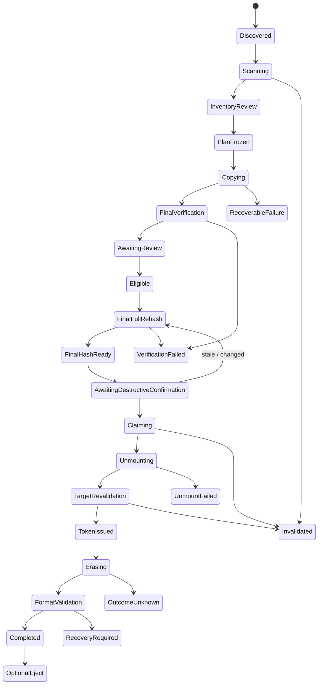
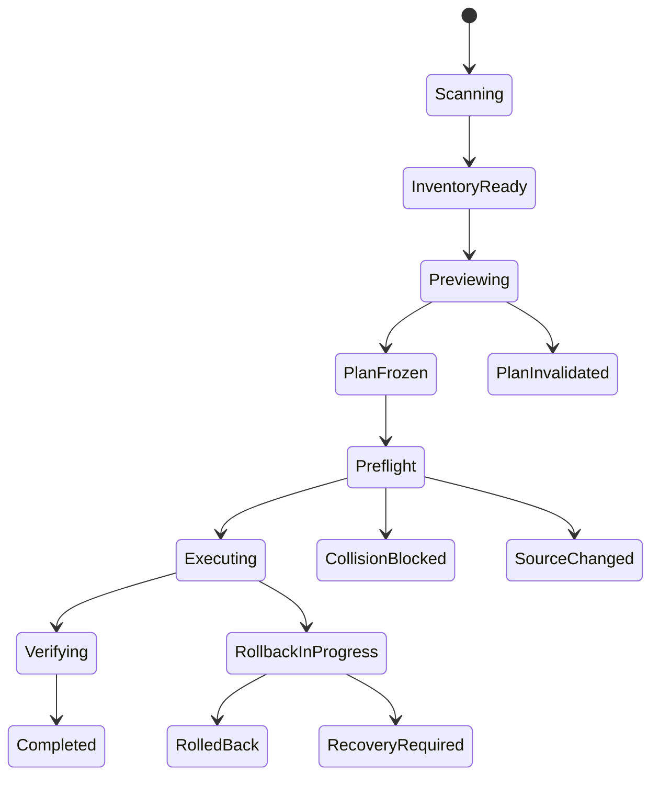

# 安全なカード初期化・既存フォルダリネーム要件

## 1. 結論

カード初期化は実装します。ただし、現行の`format_allowed: Bool`に相当する永続flagは作りません。特定の取り込みrun、Required Set、保存先検証結果、物理media identityを束ねた、短寿命・一回限り・再利用不能の`EraseAuthorizationToken`だけが初期化serviceを呼べる設計にします。

既存フォルダのリネームも実装します。既定は原本を変更しない`Copy and Rename`、高度な操作としてjournal付き`In-place Rename`を提供します。どちらも全結果を実行前にpreviewし、暗黙上書き、文字列の単純置換、途中結果の成功扱いを禁止します。

## 2. 共通安全原則

| ID | 要件 |
|---|---|
| SAFE-001 | 素材参照は`MediaAssetID`で管理し、array index／表示順を使わない |
| SAFE-002 | scene割当は`Assignment(MediaAssetID, SceneID)`だけを正本にする |
| SAFE-003 | sourceはrun内UUID、relative path、resource ID、stat、最終content hashで追跡する |
| SAFE-004 | `exists`、`copied`、`sizeMatched`、`verified`、`durableCommitted`を別状態にする |
| SAFE-005 | 走査／I/O／権限／hash errorを空集合や成功へ変換しない |
| SAFE-006 | copy／rename／erase journalはローカルApplication Support内のSQLite WALへ置く |
| SAFE-007 | 保存先、source card、NASが消失してもjournalから復旧判断できる |
| SAFE-008 | UIの表示文言ではなくdomain predicateが実行可否を決める |
| SAFE-009 | shell command文字列を組み立てず、固定executableとargument arrayを使う |
| SAFE-010 | すべてのpathをcanonical root containmentとno-follow policyで検証する |

exFATやNASではinode／resource identifierが安定しない場合があります。単一属性を永続IDとして信用せず、run内の不変ID、相対path、source pre／post fingerprint、SHA-256を組み合わせます。

# Part A：カード初期化

## 3. 「ユーザーが求めるデータ」の正式定義

### 3.1 Inventory Set

`InventorySet`は、選択カードを最後まで走査して得たentry、走査error、変更検知を含む集合です。

記録対象:

- 認識済みmovie、photo、RAW、audio
- XMP、XML、THM、SRT、WAV、LRV、AAE等のsidecar候補
- Live Photo等のpaired resource
- 未対応拡張子
- 拡張子なし
- hidden file
- symlink
- unreadable entry
- scan中に消失／追加／変更されたentry
- `.Spotlight-V100`、`.Trashes`、`.fseventsd`等のsystem metadata

system metadataは「存在しなかったこと」にせず、product-controlledなversioned allowlistにより分類・記録します。allowlist entryは正確なrelative path、entry type、期待format／size policyへ限定し、directory名だけで配下を再帰除外しません。特に`.Trashes`配下の任意fileはsystem metadataとみなさず、通常inventoryまたは明示除外reviewの対象にします。allowlist versionとdigestをrun manifest／erase tokenへ結合し、利用者設定で拡張できないようにします。

### 3.2 分類

全entryは必ず次の一つに分類します。

```text
requiredByUser
requiredCompanion
explicitlyExcludedByUser
systemMetadataAllowlisted
unknown
unreadable
changedDuringScan
```

- ERA-SET-001: `unknown`、`unreadable`、`changedDuringScan`が1件でもあれば初期化不可とする。
- ERA-SET-002: category設定がOFF、拡張子未登録、filterで非表示という理由だけで暗黙除外しない。
- ERA-SET-003: 明示除外する場合はrelative path、byte size、理由、確認者、時刻を記録する。
- ERA-SET-004: 明示除外dataが初期化で失われることを最終画面へ表示する。
- ERA-SET-005: scan errorを0件扱いしない。
- ERA-SET-006: `lstat`でsymlink、socket、device、FIFO等の非regular entryを識別し、targetを辿らない。非regular entryは明示除外されない限り初期化を阻止する。
- ERA-SET-007: required fileを開く時は`openat`＋`O_NOFOLLOW`相当と直後`fstat`を用い、走査したregular fileと同一であることを確認する。card外targetをcopy proofへ混入させない。

### 3.3 Required Asset Set

```text
RequiredAssetSet = requiredByUser ∪ requiredCompanion
```

`RequiredAssetSet`が空のrunはUMIS内初期化の対象にしません。全user fileを除外したcard、system metadataしかないcard、copy obligationが0件のcardは空集合の`allSatisfy`で成功させず、必要ならUMIS外のDisk Utility操作を案内します。

標準動作は、発見した全対応mediaを選択済みにします。利用者が今回不要なものを外す場合は、暗黙のfilter操作ではなく明示的な除外操作にします。

`requiredCompanion`は、同一directory／同一normalized basenameと、確定済みpair ruleから追加します。

例:

- `A001.MOV`＋`A001.XML`
- `IMG_0001.CR3`＋`IMG_0001.XMP`
- Live Photoの`HEIC`＋`MOV`
- movie＋明示された同録audio／subtitle

pairが曖昧な場合は自動決定せず、review待ちにします。

### 3.4 Required Delivery Set

```text
RequiredDeliverySet =
  {(assetID, destinationID)
   | assetID ∈ RequiredAssetSet
     and destinationID is required by this run}
```

指定保存先が1つならassetごとに1 obligationです。将来、二重保存policyを選んだ場合は各assetに複数obligationを持てます。

## 4. Verified copyの満足条件

各obligationは次をすべて満たした場合だけ`satisfied`になります。

1. sourceを開いた同一file descriptorから全byteを読む。
2. 読みながらsource SHA-256を計算する。
3. 読み始めと読み終わりの`fstat`／fingerprintが一致する。
4. 保存先と同一filesystem上の`.partial`へ書く。
5. dataをflushし、filesystem capabilityに応じ`fsync`／`F_FULLFSYNC`を行う。
6. closeする。
7. 保存先fileを新しいhandleで開き直す。
8. 保存先を全byte再読してSHA-256を計算する。
9. source／destinationのsizeとSHA-256が一致する。
10. no-replace atomic commitを行う。
11. final fileのidentityとmetadataを再確認する。
12. local filesystemではfinal parent directoryを`fsync`し、認定NASではprofileが定める同等のdurability operationを成功させる。
13. SQLiteを`FULL`相当のdurability policyでtransaction commitする。
14. final fileのidentity、metadata、directory durability resultをreceiptへ記録する。
15. destination root／volume identityが開始時と同一である。

状態:

```text
planned
  → copying
  → partialWritten
  → sourceHashed
  → destinationFlushed
  → destinationReopened
  → destinationHashed
  → atomicCommitted
  → parentDurablyFlushed
  → journalCommitted
  → durableCommitted
```

- ERA-COPY-001: file存在だけでは満足しない。
- ERA-COPY-002: size一致だけでは満足しない。
- ERA-COPY-003: thumbnail／preview／proxy成功をcopy proofにしない。
- ERA-COPY-004: 未検証itemをfinal名へ置かない。
- ERA-COPY-005: hash検証をOFFにする設定を作らない。
- ERA-COPY-006: parent directory durabilityが未対応／errorのdestination obligationは、erase用receiptで`durableCommitted`にしない。

## 5. Duplicate／collision／partial

既存同名は次へ分類します。

| State | 意味 | Required Setを満足できるか |
|---|---|---|
| `durableVerifiedExisting` | 今回のrunで既存fileのidentity／全内容／durabilityを再検証しreceiptをcommit | できる |
| `conflictingExisting` | hash不一致 | できない |
| `unreadableExisting` | 内容を読めない | できない |
| `previousPartial` | 過去journal／partial候補 | resumeまたは隔離後に再検証 |
| `unknownExisting` | 正体未確定 | できない |

`skip`という曖昧な成功状態は作りません。

既存同一fileを`durableVerifiedExisting`へ昇格できるのは、現在runで次をすべて満たした場合だけです。

1. destination root／volume identityを今回のobligationと照合する。
2. no-followでexisting fileを開き、open前後のresource ID／device-inode／size／statが不変である。
3. 全byteを再読してsource SHA-256と一致する。
4. local filesystemではfile syncとparent directory fsync、認定NASではprofile所定のdurability operationがerrorなしである。
5. file identity、hash、durability resultを現在runのjournalへdurable commitする。

内容hash一致だけ、過去runのreceipt、存在確認ではobligationを満足しません。sync／directory durabilityを証明できない既存fileは`unknownExisting`のままとします。

異内容collisionの選択肢:

- deterministic suffix付き別名保存
- naming plan修正
- 明示除外reviewへ戻る
- run中止

初版では既存異内容fileの上書きoptionを提供しません。

partial location:

```text
<destination>/.umis-partial/<runID>/<itemID>.partial
```

またはfinalと同一directory内の衝突不能な一時名を使います。再起動後はjournalと一致するpartialだけをresume候補にし、不一致partialは隔離します。

## 6. Source変更とfinal rescan

次のいずれかでrunを`invalidated`にします。

- source size、mtime、file resource IDがread前後で変化
- source path消失
- 同pathへ別内容が出現
- card抜去／再接続
- insertion generation変更
- final rescanで新しいuser fileを発見
- required file削除／変更
- Required／Excluded Set変更
- scene／naming／destination変更

`final rescan`ではsystem allowlist以外の追加、消失、変更を検出します。さらにRequired Setの全sourceを開き直してSHA-256を再計算し、copy時のsource hashと比較します。size／mtime／pathが同じでも内容だけが差し替わればinvalidatedです。変更後は以前のerase eligibilityを復活させず、新planと再検証を要求します。

## 7. NAS保存先

NASのmount path文字列だけをidentityにしません。

記録候補:

- security-scoped bookmark／user-selected URL
- volume resource identifier
- filesystem ID／type
- SMB server／share identifier
- mount generation
- destination root file identifier
- canonical relative root

NAS obligationには少なくとも次を要求します。

- write完了
- supported sync／flushがerrorなし
- handle close
- 新規handleで再open
- 全内容再読SHA-256一致
- verification中のreconnectなし
- share／root identity一致
- journal commit

timeout、disconnect、stale handle、reconnect、credential change、server errorを挟んだobligationは、最初から再検証するまで満足扱いしません。

NASは製品／SMB実装によりdurability意味が異なります。初期化を許可するNASはproduct-controlledな`DestinationCapabilityProfile`による事前認定対象とし、少なくとも実NASでdisk-full、disconnect、reconnect、server restart、same mount pathへの別share mountを試験します。profileはbuildまたは製品署名付きpolicyとして、server／share／filesystem構成、sync semantics、試験結果、versionへ結合し、利用者overrideを許可しません。sync未対応／error時はtokenを発行しません。

NAS-only runを初期化proofとして許可するか、独立した第2保存先を必須にするかがProduct Ownerにより確定するまでは、NAS-only obligationからerase tokenを発行しません。

現行のような再帰`chmod`／`chgrp`／ACL変更は行いません。今回作成したdirectory／fileだけを必要最小限で扱います。

## 8. Card device identity

```text
CardDeviceIdentity
  volumeUUID
  mediaUUID／device GUID（取得可能な場合）
  IORegistry media registryEntryID／parent chain digest
  identity attribute provenance
  identityStrength strongForCurrentInsertion|weak|unknown
  BSD leaf identifier at observation
  BSD whole-disk identifier at observation
  media size／block size
  vendor／model／protocol（取得可能な場合）
  isInternal
  isRemovable
  isEjectable
  isWritable
  partition topology digest
  arrivalGeneration UUID
```

BSD名は再利用され得るため主キーにしません。readerのserial／IORegistry属性がcard自身ではなくreaderを表す場合もprovenanceへ記録し、異なるSDを同じcardと推定しません。

初期化に必要な最低assuranceは、同じ連続挿入session内でappearance時から保持したDisk Arbitration media object、IORegistry media registry entry／parent chain、whole／leaf topology、media size、major／minor mappingが連続し、一度もdisappearanceしていない`strongForCurrentInsertion`です。hardware serialが取得できなくてもこの連続性を証明できる場合だけ現在runの初期化候補にできます。どれかを取得／追跡できない、またはremove eventが発生した場合は`weak／unknown`として拒否し、再挿入後はfingerprint一致でも新しいrun、binding確認、全検証が必要です。

Disk Arbitrationをappearance／disappearance、volumeとwhole diskの関係、unmount、eject、description取得の正本にします。[Apple Disk Arbitration](https://developer.apple.com/documentation/diskarbitration)

### 8.1 初版の対象制限

すべてを満たす媒体だけを候補にします。

- `isInternal == false`
- `isRemovable == true`
- `isWritable == true`
- `identityStrength == strongForCurrentInsertion`
- physical parent whole diskを解決可能
- source ingest runのidentityと一致
- network volume、disk image、system volume、Time Machine対象でない
- parent topologyに別のuser-data volumeがない
- 対象leaf以外を巻き込まない
- multi-partition mediaでない

不明値は安全側に拒否します。

### 8.2 初版format scope

初版は取り込み元として確認した単一leaf volumeを対象にします。

```text
filesystem: ExFAT
scope: leaf volume only
partition map: 維持
executor: /usr/sbin/diskutil eraseVolume
```

物理card全体を再partitionする`eraseDisk`は初版へ含めません。cameraごとにMBR／GPT等の再partitionが業務上必要と判明した場合は、別の`CardFormatProfile`、別token、別security reviewとして追加します。

macOSの`diskutil` manualでも、`eraseVolume`は既存partitionを維持してfilesystem volumeを初期化し、`eraseDisk`は全volumeとpartition schemeを消去・再作成する別操作です。

## 9. EraseAuthorizationToken

```text
EraseAuthorizationToken
  nonce UUID
  issuerAuthorityID／keyID
  runID
  issuedAt／expiresAt
  cardIdentityDigest
  arrivalGeneration
  sourceManifestDigest
  requiredDeliveryDigest
  verificationReceiptDigest
  excludedSetDigest
  systemMetadataAllowlistDigest
  destinationIdentityDigest
  formatProfileDigest
  appBuildIdentity
  authenticator／detached MAC or signature
```

### 9.1 発行predicate

```text
EraseEligible(run, card) :=
    inventoryComplete
  ∧ planFrozen
  ∧ RequiredAssetSet.isNotEmpty
  ∧ RequiredDeliverySet.isNotEmpty
  ∧ durableReceiptCount > 0
  ∧ RequiredDeliverySet.allSatisfy(durableCommitted ∨ durableVerifiedExisting)
  ∧ unknownSet.isEmpty
  ∧ unreadableSet.isEmpty
  ∧ changedSet.isEmpty
  ∧ finalSourceRescanMatchesManifest
  ∧ finalSourceFullHashesMatchCopyReceipt
  ∧ finalDestinationFullHashesMatchSource
  ∧ localJournalDurablyCommitted
  ∧ sameCardIdentityAndArrivalGeneration
  ∧ noSourceWorkerIsRunning
  ∧ exclusionsExplicitlyReviewed
  ∧ formatProfileIsValid
```

copy時の全byte再読hashは必要条件ですが、token発行には使い回しません。初期化UIは非破壊の最終検証と、破壊実行を分離します。

`最終検証を開始`を押した時:

1. Required Set全sourceをcardから開き直し、全byte SHA-256を再計算する。
2. 全required destination obligationを保存先から開き直し、全byte SHA-256を再計算する。
3. source、destination、copy receiptのhashとsizeが全件一致することを確認する。
4. final inventory、source／destination identity、allowlist digest、format profileを再照合する。

検証完了後に結果と検証完了時刻を表示し、ここでは自動初期化しません。利用者がphrase／Card Noを入力し、別のred button`初期化を実行`を明示クリックした時:

5. 最終hash完了から暫定60秒以内で、source／destination eventがなく、identity／manifestが不変であることを確認する。超過／eventありなら手順1へ戻す。
6. appのsource reader／player／thumbnail taskを全停止し、targetをclaimする。
7. normal unmountを成功させ、unmount後の同じphysical media／topologyを再照合する。失敗またはevent発生ならtokenを発行しない。
8. unmountedで内容が変化できない状態のままtokenを発行し、同じserial workflowで即消費してerase Processを起動する。

FSEvents、mtime、size、過去receiptの鮮度だけでこの最終全再読を省略しません。確認画面を長時間開いた場合も、古い検証結果からtokenを発行しません。

### 9.2 One-shot rule

- tokenはmemory-only。
- 暫定有効期限120秒。
- app再起動後に復元しない。
- erase requestをserviceへ渡した時点で消費する。
- erase失敗、timeout、結果不明でも再利用しない。
- 再試行にはidentity確認、final verification、新tokenが必要。
- emergency bypassを作らない。

### 9.3 Token authority／replay防止

通常user権限でapp processから実行できるbuildでは、`EraseAuthorizationAuthorityActor`だけがprivate initializerでtokenを生成し、memory内nonce registryをatomicに`issued → consumed`へ遷移させます。`DiskEraseService`はregistry未登録、期限切れ、使用済み、authenticator不一致を拒否します。

署名済みprivileged XPC helperが必要なbuildでは、helper側をtoken発行・検証authorityとします。helperはlocal receipt evidenceとtarget identityを独立検証し、helper専用Keychain keyでMAC／署名したopaque tokenを発行し、server-side nonce registryでatomic consumeします。appが任意digestを並べてtokenを自作できるAPIは提供しません。helperはclient audit token／code-signing requirement、Team／Bundle ID、target identity、expiry、authenticator、nonce未使用をすべて検証します。

Developer ID code-signing keyをtoken MAC／署名keyとして流用しません。helperなしbuildとhelperありbuildは別threat model／integration testを持ちます。

### 9.4 即時失効

- card抜去／再接続
- Disk Arbitration description／topology変更
- sleep／logout／app termination
- source inventory変更
- source／destination filesystem event
- destination disconnect／reconnect
- Required／Excluded Set変更
- scene、naming、destination変更
- format profile／target変更
- token timeout／使用済み

### 9.5 UI上の「初期化フラグ」

利用者に見える状態は提供しますが、保存して後から再利用するbooleanにはしません。非破壊検証を開始できる状態と、検証完了後の実行準備状態を分けます。

```text
canStartFinalVerification = ErasePrecheck(currentRun, currentlyInsertedCard)
initializationAvailable = finalFullHashesMatch
                       ∧ finalHashAge <= 60 seconds
                       ∧ noSourceOrDestinationEventSinceFinalHash
                       ∧ currentIdentityStillMatches
```

`ErasePrecheck`は非空Required Set、全obligationの`durableCommitted／durableVerifiedExisting`、inventory error 0、identity、policyを確認しますが、tokenを発行しません。どの派生値もjournal、最新volume event、destination receipt、final rescanから毎回計算し、変化時は同じevent loopでfalseへ戻します。

画面には最初に「取り込み検証済み N/N・最終検証を開始できます」、全再hash後に「最終検証済み・初期化を実行できます」と表示します。実際のtokenはred buttonクリック後のsource I/O quiesce、normal unmount、unmount後の最終identity照合を通過した時だけ発行し、直後に消費します。履歴にある過去の`formatted`／`success`値、アプリ再起動前のUI状態、VPSの完了状態からtrueへ復元しません。

## 10. 初期化状態機械



- ERA-SM-001: `Erasing`へ入る前までは取消可能。
- ERA-SM-002: destructive command開始後はcancel buttonを表示しない。
- ERA-SM-003: Process killを安全なcancelと扱わない。
- ERA-SM-004: `OutcomeUnknown`から自動再実行しない。
- ERA-SM-005: app restartでtokenを破棄し、format中だった場合は媒体状態を再調査する。

## 11. Disk Arbitration／diskutil境界

### 11.1 Disk Arbitration

- appearance／disappearance監視
- identity／topology snapshot
- volumeとwhole diskの対応
- normal unmount
- eject
- callbackによる成功／失敗確定

force unmountは通常flowで使いません。open fileがある場合は失敗させ、app自身のplayer、thumbnail、metadata taskを終了して再試行します。

### 11.2 diskutil

`CardEraseService`だけが次の固定commandを実行できます。

```text
/usr/sbin/diskutil eraseVolume ExFAT <validated-label> <exact-leaf-bsd-id>
```

要件:

- `/bin/sh -c`禁止
- `sudo`禁止
- AppleScript administrator privilege禁止
- wildcard禁止
- user-supplied executable／subcommand禁止
- validated profile、label、exact leaf identifier以外を渡さない
- BSD identifierはDisk Arbitrationからのみ導出し、初版は`^disk[0-9]+s[0-9]+$`相当のleaf形だけを受理する。UI／project／VPS文字列を受け取らない
- BSD identifierのwhole parent、major／minor、media size、registry entryを実行直前snapshotと再照合する
- `CardFormatProfile`をfilesystem enumへし、任意filesystem／subcommand stringを渡せなくする
- 初版labelはASCII大文字`A-Z`、数字、`_`だけの1〜11文字に正規化する。NUL、separator、control、whitespace、先頭`-`、空、11文字超を拒否し、暗黙truncateせず確認画面へ確定値を表示する
- human-readable outputをparseせず、事前identityはDisk Arbitrationと`diskutil info -plist`で照合
- stdout／stderrをsize制限付きで保存
- operation IDと対象digestをaudit

macOSの`diskutil info -plist`は特定whole disk／partitionをstructured property listで返します。`diskutil activity`のhuman outputはparseせず、Appleのmanualが示すとおりprogram側はDisk Arbitration clientになります。

### 11.3 Timeout

format開始後にprocessが想定時間を超えても、即killして再実行しません。

1. UIを`Outcome Unknown`へ遷移。
2. 同一deviceのDisk Arbitration eventと`diskutil info -plist`を監視。
3. 他操作と再formatをlock。
4. post-format状態を観測できた場合だけ結果確定。
5. 解決しない場合はDisk Utility／診断手順を案内。

破壊操作中のprocess終了がfilesystem operationの停止を保証しないためです。

### 11.4 Permission

まず通常user権限で対象removable volumeを初期化できる構成を実機試験します。権限不足時に任意shell／再帰permission修復へfallbackしません。

署名済みprivileged helperが不可欠と判明した場合だけ、Service ManagementとXPCを使う最小機能helperを別security review対象にします。helper側でもclient audit token／code identity、opaque authenticated token、nonce未使用、internal／removable、device identity、label／BSD IDを再検証し、任意root command APIを提供しません。[Apple Service Management](https://developer.apple.com/documentation/servicemanagement)

## 12. TOCTOU対策

format開始直前に次を再照合します。

- exact CardDeviceIdentity digest
- whole disk／leaf topology
- `isInternal == false`
- `isRemovable == true`
- writable
- arrival generation
- BSD current mapping
- media size
- source manifest／final full SHA-256
- 全required destinationのfinal full SHA-256
- NAS mount generation
- token期限／未使用

unmount callback成功後、`diskutil`起動直前にもcurrent BSD mapping、major／minor、media size、parent identityを再解決します。`/dev/diskN`が別mediaへ再利用された場合は拒否します。

targetごとのserial executorとglobal erase operation lockを持ち、確認開始からProcess起動まで別erase requestを許可しません。`DADiskClaim`を保持した状態で`diskutil eraseVolume`が対象OS／readerで正しく動作するか実機検証します。競合する場合は、claim解除後に同じserial executor上で即時再照合してProcessを起動し、その間のdisappearance／topology eventを開始前なら中止、開始後なら`OutcomeUnknown`へ遷移させます。

このclaim／再照合protocolで交換raceを閉じられないreader、OS、permission構成ではformat featureを有効化しません。unmount後からProcess起動までの高速交換を専用hardware QAでfault injectionします。

確認画面中は対象を固定します。別cardが接続されてもその画面の対象へ自動切替しません。

## 13. 初期化確認UI

単なる警告dialogを3回連続表示するのではなく、「何が検証され、何が消えるか」を一画面で示します。

表示項目:

- Card No
- volume label
- vendor／model
- 容量／filesystem
- physical identity digest末尾
- Required Set件数／byte
- verified copy件数／byte
- verified existing件数
- explicitly excluded件数／byteと展開可能な一覧
- unknown／unreadable／changed件数
- destination path／volume／NAS identity
- final verification時刻
- format後filesystem／label
- 最終全hashの完了時刻／鮮度残り時間。tokenはまだ発行しない

操作は二段階です。

- `最終検証を開始`: `canStartFinalVerification`で押せる非破壊button。Required Set source／全destinationを再hashし、完了しても自動初期化しない
- 検証結果を表示した後だけphrase／Card No入力を有効化
- `初期化を実行`: destructive red button。freshな`initializationAvailable`、入力一致、確認checkで押せる。クリック後にquiesce／unmount／identity再照合／token発行・即消費を行う
- default buttonにしない
- Returnだけで実行不可
- 数秒の意図的待機
- 画面指定phraseまたはCard Noを手入力
- excluded itemがある場合は「消去されることを確認」の明示check
- 検証鮮度超過、source／destination event、identity changeでred buttonを即disabledにし、非破壊の最終検証へ戻す
- VoiceOverが対象、容量、不可逆操作、無効理由を読み上げる

## 14. Post-format validation

`diskutil` exit code 0だけで成功にしません。

1. 同じIORegistry media object／physical parent continuityに結び付いた再appearanceを待つ。formatでVolume UUIDが変わっても、readerだけのfingerprintや同容量だけで同一mediaと推定しない。
2. 新volume UUIDを取得する。
3. filesystemがprofileと一致する。
4. labelが一致する。
5. writableである。
6. expected capacity範囲内である。
7. rootを列挙できる。
8. 小さなprobe fileをwrite、flush、close、reopen、read、deleteできる。
9. OS metadata以外の旧user fileがない。
10. before／after identity、resultをauditへcommitする。

ここまで完了して初めて`Completed`を表示します。format後にVolume UUIDが変わることは正常なので、Card Noのbusiness bindingにはbefore／afterを明示記録します。OS／readerがphysical parent continuityを証明できない場合は成功と別に`Identity Continuity Unconfirmed`としてmanual reviewへ送り、自動的に別cardへ履歴を結び付けません。

## 15. Erase audit

append-only auditに次を保存します。

- run ID、app version、build、code-signing identity
- host／operator pseudonymous ID
- card identity digest／arrival generation
- source manifest、Required／Excluded Set digest
- destination identity／verification receipt digest
- item別source／destination hash
- duplicate decision
- token発行／失効／消費
- confirmation
- exact format profile
- safe representation of diskutil args
- stdout／stderr、exit status
- Disk Arbitration callbacks
- post-format verification
- error／recovery

credential、password、private keyは保存しません。audit eventはhash chainと定期signed checkpointで改変検知可能にします。

## 16. カード初期化の必須受入試験

| ID | Scenario | 合格条件 |
|---|---|---|
| ERA-AT-001 | scene割当後にsort | 画面で割り当てた同じMediaAssetIDだけがcopyされる |
| ERA-AT-002 | 同名・同size・異内容 | SHA-256不一致、tokenなし |
| ERA-AT-003 | 同名・同内容 | 今回全再hashした場合だけverified existing |
| ERA-AT-004 | disk full／抜線／kill | 不完全finalを成功扱いしない |
| ERA-AT-005 | previous partial | 無条件skipせずresume／隔離 |
| ERA-AT-006 | sourceをcopy中／後に変更 | run invalidated |
| ERA-AT-007 | final verification後にcardへ追加 | token失効 |
| ERA-AT-008 | 同名・同容量の別cardへ交換 | format拒否 |
| ERA-AT-009 | 同じmount path／BSD名を再利用 | format拒否 |
| ERA-AT-010 | expired／used／previous-launch token | format拒否 |
| ERA-AT-011 | NAS disconnect／reconnect | 再検証までtokenなし |
| ERA-AT-012 | 同mount pathの別share | identity不一致、tokenなし |
| ERA-AT-013 | unknown／unreadable／scan error | button disabled |
| ERA-AT-014 | internal／DMG／network／multi-partition | 候補にできない |
| ERA-AT-015 | unmount失敗 | UIとrun stateを保持しretry可 |
| ERA-AT-016 | erasing中にapp kill | 起動後に自動再formatしない |
| ERA-AT-017 | exit 0、post-probe失敗 | success表示しない |
| ERA-AT-018 | profile／label変更 | old token失効 |
| ERA-AT-019 | card取り込み中にeject | copyを安全停止／journal commit前はeject不可 |
| ERA-AT-020 | 10,000 item／NAS latency | main thread blockなし |
| ERA-AT-021 | source内容だけ変更しsize／mtimeを復元 | 最終source全hash不一致、tokenなし |
| ERA-AT-022 | copy後にdestination内容だけ同size差替え | 初期化操作時の全destination再hashで拒否 |
| ERA-AT-023 | 確認画面を長時間開いて保存先変更 | 古いreceiptを使わず最終全hashで拒否 |
| ERA-AT-024 | `.Trashes`内にuser file | 再帰allowlistせずinventory／review対象 |
| ERA-AT-025 | card上symlinkがcard外fileを指す | targetを読まず、明示除外までtokenなし |
| ERA-AT-026 | weak／unknown media identity | format候補外。再挿入で過去状態復活なし |
| ERA-AT-027 | forged／modified／replayed token | authenticator／nonce registryで全拒否 |
| ERA-AT-028 | helper／app restart後のtoken再送 | token拒否、自動再formatなし |
| ERA-AT-029 | label先頭`-`／NUL／11文字超、偽BSD ID | profile validationでProcess起動前拒否 |
| ERA-AT-030 | unmount後〜Process起動前に高速交換 | identity不一致でProcess起動0件 |
| ERA-AT-031 | parent directory sync failure | receiptがdurableCommittedにならずtokenなし |
| ERA-AT-032 | 犠牲SD／複数reader／最低・最高macOS | 署名済みrelease candidateでmanual destructive QA全合格 |

# Part B：既存フォルダからのリネーム

## 17. 機能モード

### 17.1 Copy and Rename（既定）

既存folderをsourceとしてscanし、rename後のfileを別のdestination folderへverified copyします。原本は変更しません。

### 17.2 In-place Rename（高度な操作）

同じfolder／filesystem内でname／relative pathを変更します。

- 初回warning
- dry-run必須
- journal必須
- same filesystemのみ
- crash recovery必須
- rollback／undo条件を明示
- overwriteなし

### 17.3 Output layout

選択肢:

- 元relative directory構造を維持し、file名だけ変更
- category／day／scene folderへ再構成
- flat output。ただし全collisionを先に解消

禁止:

- destination inside source
- source inside destination
- sourceとdestination同一。ただし明示in-placeを除く
- `/`、home全体、volume root、system directory等の広すぎるroot

## 18. RenamePlan

```text
RenamePlan
  transactionID
  mode
  sourceRootIdentity
  destinationRootIdentity
  sourceInventoryDigest
  namingRuleVersion
  metadataPolicyVersion
  items[]
  planDigest
  createdAt

RenamePlanItem
  MediaAssetID
  sourceRelativeURL
  sourceFingerprint
  destinationRelativeURL
  companionGroupID
  companionGroupMemberDigest
  sequenceNumber
  collisionResolution
```

- REN-PLAN-001: 実行前に全before／after pathをpreviewする。
- REN-PLAN-002: changeなし、collision、invalid、sidecar、excludedを分類表示する。
- REN-PLAN-003: previewしたplanをそのまま実行し、実行時に命名を再計算しない。
- REN-PLAN-004: scene、location、photographer、Card No、date、sort、rule、destination変更でplanをinvalidateする。
- REN-PLAN-005: deterministic sort keyからsequenceを決める。
- REN-PLAN-006: source rootの全entry inventory digestと各companion group member集合digestをplanへ含める。

推奨sequence key:

```text
capturedAtUTC
→ normalized original relative path
→ content hash
→ MediaAssetID
```

## 19. Naming／path safety

`FilenameComponents`からpure functionでpreview／実行の両方を生成します。既存filename内のscene文字列を`replace()`しません。

各path component:

- Unicode NFC
- `/`、NUL、control character禁止
- `.`、`..`禁止
- empty禁止
- leading／trailing whitespace policy固定
- reserved `.umis-` prefix禁止
- component／full path上限検査
- deterministic shortening＋short hash

case sensitivityとUnicode normalizationは実destination filesystemへ照会します。

衝突候補:

- `ABC.mov`／`abc.mov`
- NFC／NFDで同じ表示
- trim後に同名
- shortening後に同名
- plan作成後に別processが作った同名

final commitではatomic no-replaceを再確認します。macOSで利用可能なfilesystemでは`renameatx_np`の`RENAME_EXCL`、`RENAME_NOFOLLOW_ANY`、`RENAME_RESOLVE_BENEATH`等を専用POSIX adapterから使用します。原子的な排他commitを証明できないfilesystemではin-place renameを拒否し、check-then-renameや通常`rename()`へfallbackしません。copy-and-renameも同等のatomic no-replace primitiveを提供できないdestinationでは実行不可とし、未検証dataをfinal名へ置きません。

## 20. Symlink／hard link／package

- symlinkはdefaultで辿らず、対象外として表示する。
- advancedでlink自身をrenameする場合もtargetを操作しない。
- root外へresolveするpathを拒否する。
- path途中のsymlink差替えに対し、directory descriptor、`openat`系、`O_NOFOLLOW`、直前`lstat`を使用する。
- hard linkをdevice／inodeで検出し、previewへ表示する。
- package directoryはdefaultで再帰走査しない。

## 21. Sidecar／paired media

同一relative directory＋同一normalized basenameを基本groupとします。

候補allowlist:

- XMP
- XML
- THM
- SRT
- WAV
- LRV
- AAE
- Live Photo pair

本体`A001.MOV`を`Scene01_0001.MOV`にする場合、sidecarを`Scene01_0001.XML`等へ揃えます。group内1件でもcollision、source change、permission errorがあればgroup全体を実行しません。曖昧なpairはreview待ちです。

## 22. Collision policy

実行前にplan内collisionと既存destinationを全件検査します。defaultはblockです。

安全な選択肢:

- deterministic suffix
- sequence再計算
- naming field修正
- transactionから明示除外
- 既存fileを全hashし、同一ならverified existing
- transaction中止

初版では異内容fileの上書きを提供しません。final commit時にもno-replaceを使用し、TOCTOUで作成された同名を上書きしません。

## 23. Copy and Rename execution

card ingestと同じcopy primitiveを再利用します。

- destination `.partial`
- streaming source SHA-256
- destination flush／close／reopen
- destination full SHA-256
- atomic no-replace commit
- SQLite journal
- bounded concurrency
- chunk cancellation
- resume

原本削除を同じflowで提案しません。削除が将来必要でも別機能／別認可とします。

metadata policy:

- content dataは必ず同一
- creation／modification date
- xattr／Finder tag
- ACL
- resource fork

どれを保持するかをpolicy化し、未対応metadataはcontent failureではなくwarningとして明示します。

## 24. In-place transaction

### 24.1 Preflight

全source fingerprint、root identity、writabilityを実行直前に再確認します。source rootを再走査してinventory digestを再計算し、entry追加／削除、新sidecar候補、pair関係、group member集合が変わればtransaction全体をinvalidateします。FSEventsが通知しなくてもこのpreflightを省略しません。

final pathの占有は次へ分類します。

- 外部entryが占有: collisionとして拒否
- 同じtransactionのsourceが占有: rename dependencyとして許可
- 同内容の既存file: copy-and-renameだけでverified existing候補。in-placeでは外部entryとして扱う
- 空: 通常final候補

したがって`A→B`、`B→C`、swap、case-only renameで「destinationが存在する」ことだけを失敗にしません。占有者がplan内sourceかをstable identityで照合します。

### 24.2 Two-phase rename

初版のin-place engineはcycleの有無にかかわらず、変更対象の全itemを一意temporary nameへstageしてからfinalへ移します。これによりchain、cycle、swap、case-only renameを一つのrecovery modelで扱います。

```text
Phase 1: original → .umis-rename-<transaction>-<item>
Phase 2: temporary → final
```

`A→B`、`B→A`、`A→B→C`、`a.mov→A.mov`を直接実行しません。rename graphのdependency／strongly connected componentはpreflight説明と最適化判断に利用しますが、実処理は全sourceをstageした後にfinal commitします。

必要なfinal directoryもplanへ列挙し、既存directory identityと新規directoryを区別します。各mkdir／atomic renameは必ず次のwrite-ahead順序で処理します。

```text
intent durable commit
→ mkdir／rename syscall
→ 変更したsource／destination parent directory fsync
→ applied durable commit
```

transactionが作成したdirectoryだけをjournalに記録し、rollback時に空であることを確認して逆順削除します。既存directoryを削除／改名しません。cross-volume moveはin-placeとして扱わず、verified copyへ切り替えます。

### 24.3 External change

FSEvents／vnode eventはchange hintとして利用し、実操作直前の`lstat`／fingerprintで最終確認します。監視eventだけを正本にしません。

## 25. Rollback／recovery／undo

### 25.1 Runtime rollback

失敗時はjournalからreverse planを構成します。pathに対象が存在するだけではtransactionのfileとみなさず、各entryをno-followで開き、journalに記録したtransaction ID、file resource ID、device／inode、size、全内容SHA-256と照合します。1項目でも不一致、読取不能、identity変化があれば、そのentryを移動せずtransaction全体を`Recovery Required`として停止します。

rollback先を外部entryが占有している場合は上書きしません。同じreverse transactionの別sourceが占有している場合だけrename dependencyとして扱い、必要な全entryを一意なrecovery staging名へ先に退避してから元pathへcommitします。各rollback mutationも通常実行と同じく、`rollback intentのdurable commit → atomic no-replace rename → 移動元／移動先parent directoryのdurable fsync → rollback appliedのdurable commit`を必須にします。check-then-rename、通常`rename()`、外部entryの置換へfallbackしません。

### 25.2 Crash recovery

起動時に未完transactionを検出し、各itemを分類します。

```text
atOriginal
atStaging
atFinal
missing
unexpectedCollision
```

分類はpath名だけで行いません。`atOriginal／atStaging／atFinal`の各候補をno-followで開き、transaction ID、file resource ID、device／inode、size、全内容SHA-256がjournalの期待状態と一致した場合だけtransaction itemとして認定します。複数pathに同一itemらしきentryがある、identityが一致しない、journalのdurable境界とfilesystem状態が対応しない場合は`Recovery Required`とし、自動操作を行いません。

自動で安全と証明できる場合だけresume／rollbackを提案します。resume／rollbackのすべてのrenameも、実行前identity再照合、durable intent、atomic no-replace、両parent directory fsync、durable applied recordの順で行います。recovery UIは推定による「修復」をせず、証拠bundleの書き出しと手動退避手順を提示します。

### 25.3 Copy-to-new Undo

今回作成したfileがreceiptどおりで、利用者変更がない場合だけTrashへ移動できます。

- changed fileは削除しない。
- verified existingは削除しない。
- transactionが作成した空directoryだけ削除する。
- sourceは無変更。

### 25.4 In-place Undo

reverse rename planを新transactionとしてdry-runします。全final entryのtransaction ID、file resource ID、device／inode、size、全内容SHA-256がreceiptと一致することを必須にします。original pathを外部entryが占有する場合はblockしますが、同じreverse transactionの別sourceが占有する場合はrename dependencyとして許可します。

Undo対象の全entryを一意temporary nameへ先にstageし、その全stageとjournal durable commitが完了してからoriginal pathへatomic no-replace commitします。したがってswap、chain、cycle、case-only renameも通常renameと同じdependency graph、two-phase staging、journal、parent directory fsync、recovery protocolで扱います。Undo中も外部entryを上書きしません。

## 26. Rename state machine



Copy and Renameはfile単位で安全停止できます。In-placeでPhase 1開始後にcancelされた場合は「現在のatomic operation後にrollback」と正確に表示します。

## 27. Rename audit

- transaction ID／mode
- source／destination root identity
- naming／metadata policy version
- plan digest
- 全before／after relative path
- source fingerprint／content hash
- companion group
- collision decision
- sequence key
- staging name
- copy／rename／verify result
- rollback／undo
- app／host／operator／timestamps
- error

絶対path、個人名を外部へ不要に送らず、diagnostic exportでredact可能にします。

## 28. リネーム必須受入試験

| ID | Scenario | 合格条件 |
|---|---|---|
| REN-AT-001 | dry-runと実行 | 全final path一致 |
| REN-AT-002 | preview後source変更 | plan invalidated |
| REN-AT-003 | A→B、B→A | lossなしで完了／undo |
| REN-AT-003A | A→B、B→Cの非cycle chain | 全sourceをstageし上書き0で完了／undo |
| REN-AT-004 | case-only APFS rename | 正常完了 |
| REN-AT-005 | NFC／NFD collision | 実行前block |
| REN-AT-006 | 同名異内容既存 | 上書き0 |
| REN-AT-007 | 同size異内容 | hashでcollision |
| REN-AT-008 | sidecar group | 同一basenameへall-or-nothing |
| REN-AT-009 | sidecar一件collision | 本体だけ変更しない |
| REN-AT-009A | preview後に新XMP／XML追加 | inventory／group digest不一致でplan全体invalidated |
| REN-AT-010 | root外symlink | target非操作 |
| REN-AT-011 | scan後directoryをsymlink差替え | root外write 0 |
| REN-AT-012 | source／destination入れ子 | 実行不可 |
| REN-AT-013 | Phase 1／2各境界でkill | journal recovery成功 |
| REN-AT-013A | mkdir／parent fsync／applied commit各境界でkill | 作成directoryを含めresume／rollback可能 |
| REN-AT-014 | rollback pathへ外部file | 上書きせずRecovery Required |
| REN-AT-015 | copy modeでdisk full／NAS切断 | source無変更、不完全finalなし |
| REN-AT-016 | undo前に生成fileを編集 | 削除しない |
| REN-AT-017 | hard link／xattr／ACL | policyどおり |
| REN-AT-018 | 100,000 file preview | UI仮想化、main thread blockなし |
| REN-AT-019 | 同じinput／settings | sequence／output deterministic |
| REN-AT-020 | 必須naming field欠落 | 実行前に全件表示 |

## 29. 実装前に残るpolicy選択

1. NASだけを保存先にした場合、認定NAS＋全再読hashで初期化可能とするか、独立第2保存先も要求するか。
2. 明示除外itemがあるcardをreview後に初期化可能とするか、除外0件だけに限定するか。
3. `CardFormatProfile`のlabel文字規則とcamera互換性。
4. sidecar正式allowlist。
5. Copy and Renameのdefault layoutを「元階層維持」または「category／scene再構成」のどちらにするか。
6. In-place Renameのproduction有効化時期。安全側の初版はcopy-and-renameだけを有効化し、in-place実装はfeature flag OFF／release artifactから通常到達不能とし、専用fault／recovery gate通過後の版で有効化します。

安全側の暫定default:

- leaf volume、ExFAT、multi-partition拒否
- unknown／unreadableは1件でも初期化拒否
- explicit exclusionは個別review必須
- tokenはmemory-only、120秒、one-shot
- emergency formatなし
- Copy and Renameをdefault
- 初回production releaseはIn-place Renameを無効化
- overwriteなし
- all modeでdry-run必須
- sidecar groupはall-or-nothing
